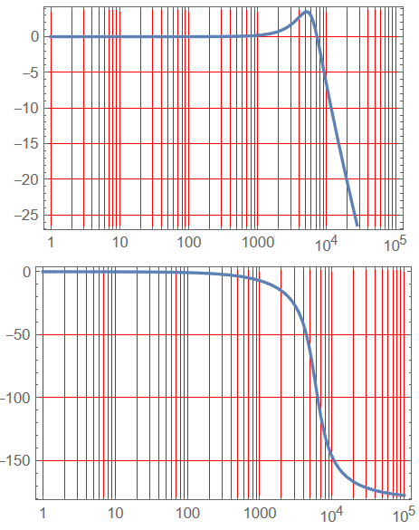
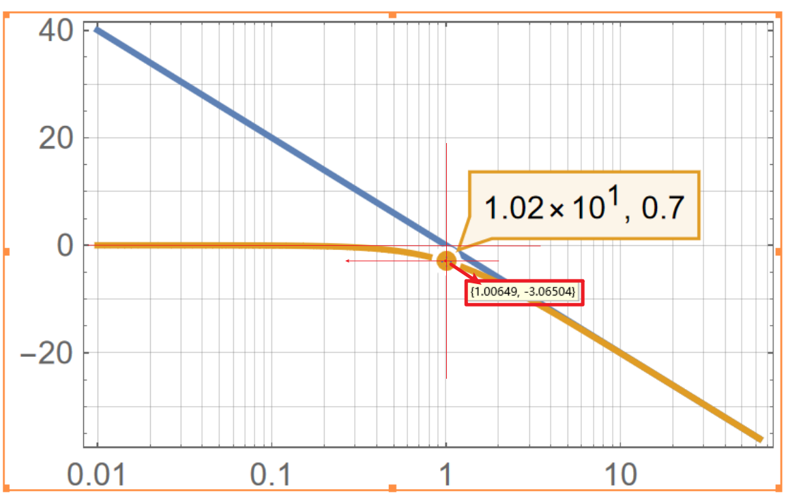
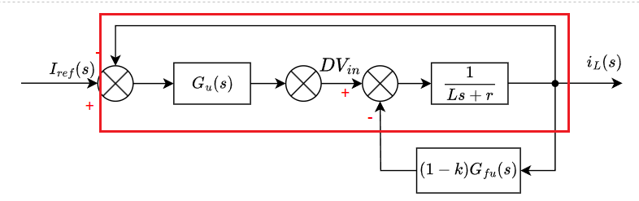

## 一、能量存储与传输器件

DC-DC功率变换电路利用能量存储器（<font color = red>电感器</font>）件进行滤波，利用能量传输器（<font color = red>电容器</font>）件来传输电能，以改变电压和电流的幅度。

### 1.1 电感器

​	参考创客皮特的电感基础系列文章：

- [电感基础1——为什么把‘线’绕成‘圈’就是电感？什么是电感？](https://zhuanlan.zhihu.com/p/149748238)
- [电感基础2——电感的单位、电压电流关系、时间常数和阻抗 ](https://zhuanlan.zhihu.com/p/149830125)
- [电感基础2——电感的单位、电压电流关系、时间常数和阻抗](https://zhuanlan.zhihu.com/p/149830125)
- [电感基础4——什么是LC电路的“谐振频率”？](https://zhuanlan.zhihu.com/p/156456031)
- [电感基础5——电感选型时需要考虑什么？额定电流、饱和电流、自谐振频率……](https://zhuanlan.zhihu.com/p/157376214)

### 1.2 电容器

​	参考创客皮特的电感基础系列文章：

- [电容基础1——储能和滤波](https://zhuanlan.zhihu.com/p/145810291)
- [电容基础2——充放电时间常数](https://zhuanlan.zhihu.com/p/146297149)
- [电容基础3——阻抗和容抗](https://zhuanlan.zhihu.com/p/146444827)
- [电容基础4——电容种类和ESR（等效串联电阻），超级电容能否代替电池？](https://zhuanlan.zhihu.com/p/148037515)
- [电容基础5——RC低通滤波器和RC高通滤波器 ](https://zhuanlan.zhihu.com/p/148159402)

### 1.3  磁通平衡与伏秒平衡、电荷平衡与安秒平衡！

请参考：[1 磁通平衡与伏秒平衡、电荷平衡与安秒平衡！ - 知乎 (zhihu.com)](https://zhuanlan.zhihu.com/p/349733079)

## 二、 单电感统一模型

### 2.1 基本理论

<font color=red>核心思想：有且仅有、降本增效</font>

主要的非隔离型DCDC变换器分为两类，单电感模型、双电感模型

​                                                                                                                            <span id="三个端子">单电感模型-三个端子</span>


​                                                                                                                         	<span id="两个端子">*单电感模型-两个端子*</span>


电感的公式：<font size=5>$V_L = L\frac{di_L}{dt}$</font>      $\rightarrow$     <font size=5>$\Delta i_L = \frac{1}{L} \int_{0}^{T}V_Ldt$</font>

​	由上式可知：电流为电压的积分，电压可以突变，电流不能突变

​	对于一个稳定的系统，稳定后电感要处于平衡状态，即一个周期T内电感的电流变化量要为0，否则会一直上升或下降，从而脱离平衡状态（详见1.3节）。


电感电流、电压在一个周期T内的变化如图所示，也就是电感两端电压的积分为0，意味着稳定后电感电压的平均值为0

​                                                                                                         <font color=red size=5>$V_{avg} = \frac{1}{T} \int_{0}^{T}V_Ldt$</font>

对于单电感模型：$arg(V_L)==0  \rightarrow  arg(V_X-V_Y)==0  \rightarrow  arg(V_X)==arg(V_Y)$

​	[两个端子时](#两个端子)：$arg(V_X)==arg(V_Y)     \rightarrow   $           <font color=red>$V_X == V_Y$</font>

​	[三个端子时](#三个端子)：$arg(V_{X1},V_{X2})==arg(V_Y) == V_Y$

​						$V_{avg} = \frac{1}{T}(\int_{0}^{T_{X1}}V_{X1}dt + \int_{0}^{T_{X2}}V_{X2}dt)  =\frac{1}{T}\int_{0}^{T_Y}dt$

​				$\Rightarrow \int_{0}^{T_{X1}}V_{X1}dt + \int_{0}^{V_{X2}}V_{X2}dt = \int_{o}^{T}V_Ydt$

​	    		$\Rightarrow T_{X1}V_{X1} + T_{X2}V_{X2} = T_YV_Y$    <font color=purple> ($T = T_Y = T_{X1} + T_{X2}$)</font>

<font color=red>当时间全部作用在$V_{X1}$上时：$T_YV_{X1}=T_YV_Y   \Rightarrow V_Y = V_{X1}$</font>

<font color=red>当时间全部作用在$V_{X2}$上时：$T_YV_{X2}=T_YV_Y  \Rightarrow  V_Y = V_{X2}$</font>

​				<font color=red>所以对于单电感模型来说：$V_Y$必然介于$V_{X1}$和$V_{X2}$之间。</font>

​				对于单电感DCDC变换器来说，有三个电平0、$V_{in}$、$V_{out}$。所以有且仅有三种可能：

|       |        $V_X$        |   $V_Y$   |              备注              |
| :---: | :-----------------: | :-------: | :----------------------------: |
| 端口  |    $X_1$、$X_2$     |    $Y$    |                                |
| 类型1 |     0，$V_{in}$     | $V_{out}$ |    $0<V_{out}<V_{in}$，Buck    |
| 类型2 |    0，$V_{out}$     |  $V_in$   |   $0<V_{in}<V_{out}$，Boost    |
| 类型3 | $V_{in}$，$V_{out}$ |     0     | $V_{out}<0<V_{in}$，Buck-Boost |

### 2.2 三种基本电路

​				单电感模型如下图示：


#### 2.2.1 buck电路（0 < $V_{out}$ < $V_{in}$）

​	根据单电感模型设计：<font color=red>$V_Y$必然介于$V_{X1}$和$V_{X2}$之间，当$0 < V_{out} < V_{in}$ 时</font>

开关管有MOSFET、IGBT等，选用开关管进行填充	


​	只考虑能量单向流动，可以用续流二极管（便宜）代替开关管，根据能量流动分析，只有如下情况符合设计逻辑：

由单电感统一模型的结论$\Rightarrow T_{X1}V_{X1} + T_{X2}V_{X2} = T_YV_Y$    <font color=purple> ($T = T_Y = T_{X1} + T_{X2}$)</font>

对于开关管：$T = T_{on} + Y_{off}$

​						$d = \frac{T_{on}}{T}$

在连续状态下，计算输出电压和输入电压的比例关系：$\Rightarrow T_{X1}V_{X1} + T_{X2}V_{X2} = T_YV_Y$ 

​																							$\Rightarrow dT\cdot V_{in} + 0\cdot \frac{(1 -d)}{T} = V_{out}\cdot T$

​																							$\frac{V_{out}}{V_{in}} = d$

电路输出分析：

​	开关管闭合时，

#### 2.2.2 Boost电路（0 < $V_{in}$ < $V_{out}$)

根据单电感模型设计：<font color=red>$V_Y$必然介于$V_{X1}$和$V_{X2}$之间，当$0 < V_{in} < V_{out}$ 时</font>


为适应正常情况下左侧输入，右侧输出的看图习惯，并用开关管进行填充：

只考虑能量单向流动，可以用续流二极管（便宜）代替开关管，根据能量流动分析，只有如下情况符合设计逻辑：

在连续状态下，计算输出电压和输入电压的比例关系：$\Rightarrow T_{X1}V_{X1} + T_{X2}V_{X2} = T_YV_Y$ 

​																							$\Rightarrow V_{in}\cdot T = dT\cdot 0 + (1-d)T\cdot V_{out}$

​																							$\frac{V_{out}}{V_{in}} = \frac{1}{1-d}$

#### 2.2.3 Buck-Boost电路($V_{out} < 0 < V_{in}$)

根据单电感模型设计：<font color=red>$V_Y$必然介于$V_{X1}$和$V_{X2}$之间，当$V_{out} < 0 < V_{in}$时，由此可知$V_{out}$和$V_{in}$是反向的。</font>,


根据看图习惯，改为一边输入，一边输出，并用开关管进行填充：

只考虑能量单向流动，可以用续流二极管（便宜）代替开关管，根据能量流动分析，只有如下情况符合设计逻辑：

在连续状态下，计算输出电压和输入电压的比例关系：$\Rightarrow T_{X1}V_{X1} + T_{X2}V_{X2} = T_YV_Y$ 

​																							$\Rightarrow dT\cdot V_{in} - (1 - d)T\cdot V_{out} = 0$

​																							$\frac{V_{out}}{V_{in}} = \frac{d}{1-d}$

当$d < 0.5$时： $\frac{V_{out}}{V_{in}} < 1$     $\rightarrow$  $V_{out} < V_{in}$   $\rightarrow$ Buck电路

当$d > 0.5$时： $\frac{V_{out}}{V_{in}} > 1$     $\rightarrow$  $V_{out} > V_{in}$   $\rightarrow$ Boost电路

## 三、 双电感统一模型

### 3.1 基本理论

​	双电感统一模型实际上就是把两个单电感统一模型相互连接在一起了，怎么将两个电感串联起来还不影响单电感统一模型的结论呢？最终选择用一个电容<font color=red>$C_f$</font>将两个电感隔开。<font color=red>$C_f$</font>上的电流可以突变，但是电压不能突变，正好和电感相反，所以可以通过它调节换态后的电流方向。

​	双电感统一模型的电路图如下：


​	我们把整体当作两个单电感统一模型来逐一分析：

对于$L_1$：B点相当于[单电感统一模型](#三个端子)的X端，A点相当于Y端，根据单电感统一模型的结论：$T_{x1}V_{x1} + T_{x2}V_{x2} = T_yV_y (T = T_y = Y_{x1} + T_{x2})$

​	对于单电感统一模型，由于电感特性，要保证电感磁通平衡，也就是A端和B端的平均电压要相等。

​				得到$L_1$两端平均电压计算公式：$dT\cdot V_B + (1-d)T\cdot (V_C + V_f) = V_A\cdot T$                                                             

​												       化简得：<span id="1式">$V_A = d\cdot V_B + (1-d)\cdot (V_C + V_f)$</span>                                                       [ <font color=red>1式</font>](#1式)

对于$L_2$：C点相当于[单电感统一模型](#三个端子)的X端，D点相当于Y端，根据单电感统一模型的结论：$T_{x1}V_{x1} + T_{x2}V_{x2} = T_yV_y (T = T_y = Y_{x1} + T_{x2})$

​	对于单电感统一模型，由于电感特性，要保证电感磁通平衡，也就是C端和D端的平均电压要相等。

​				得到$L_2$两端平均电压计算公式：$dT\cdot (V_B - V_f) + (1-d)T\cdot V_C = V_D\cdot T$                                                             

​												       化简得：<span id="2式">$V_D = d\cdot (V_B - V_f) + (1-d)\cdot V_C$</span>                                                       [ <font color=red>2式</font>](#1式)

​	[ <font color=red> 1式</font>](#1式)展开：$V_A = dV_B + V_C + V_f - dV_C - dV_f$

​	[ <font color=red> 2式</font>](#1式)展开：$V_D = dV_B -dV_f + V_C -dV_C$

​	观察后继续化简[<font color=red>1式</font>](#1式)：<span id="3式">$V_A = dV_B - dV_f + V_C - dV_C + V_f$</span>

  [ <font color=red>1式</font>](#1式) - [ <font color=red>2式</font>](#1式)得：<span id="3式">$V_A - V_D = V_f$</span>															                                               							[<font color=red>3式</font>](#3式)

将[<font color=red>3式</font>](#3式)代入[ <font color=red>1式</font>](#1式)或[ <font color=red>2式</font>](#1式)得：$V_A = dV_B + V_C + V_A - V_D -dV_C - dV_A+ dV_D$

​							 			 $dV_A - dV_B = V_C - V_D - dV_C + dV_D$

​					     			   $d(V_A - V_B) = (1-d)V_C - (1 - d)V_D$ 

​				    			得：<span id="4式"> $d(V_A - V_B) = (1 - d)(V_C - V_D)$</span>	                                                                                     [<font color=red>3式</font>](#3式)

接下来就是把$0 、 V_{in} 、 V_{out}$分配到A、B、C、D这四个位置上去，四个位置分配三个电压，意味着肯定有两个点位是相同的，不妨设相同的点位为$V_{x1}$,剩下两个分别是$V_{x2}、V_{x3}$,在分配时要注意以下几点：

1. A点 $\neq$ B点
2. C点 $\neq$ D点
3. A点 $\neq$ D点

> 具体原因如下：
>
> 1. A点 $\neq$ B点
>
>    将$L_1$当作一个单电感统一模型分析，A点相当于Y端，B点相当于X端，根据电感磁通平衡条件可知$V_A = d\cdot V_B + (1-d)\cdot (V_C + V_f)$
>
>    若$V_A = V_B$，意味着$d = 1$，此时明显不符合电感磁通平衡条件，所以说A点 $\neq$ B点。
>
> 2. C点 $\neq$ D点
>
> ​	  将$L_2$ 当作一个单电感统一模型分析，C点相当于X端，D端相当于Y端，根据电感磁通平衡条件可知$V_D = d\cdot (V_B - V_f) + (1-d)\cdot V_C$
>
> ​	  若$V_C = V_D$，意味着d = 0，此时明显不符合电感磁通平衡条件，所以说C点 $\neq$ D点
>
> 3. A点 $\neq$ D点
>
>    由电感磁通平衡条件可知$avg(V_A) = avg(V_B)$、$avg(V_C) = avg(V_D)$，代入[<font color=red>3式</font>](#3式)（$V_A - V_D = V_f$）结论得到$(V_B - V_C = V_f)$,若$V_A = V_D$,则相当于两个电感之间是通过导线连接，不符合双电感统一模型基本理论。

遵循上述分配注意点，分配情况有如下六种：

|    A     |    B     |    C     |    D     |
| :------: | :------: | :------: | :------: |
| $V_{x1}$ | $V_{x2}$ | $V_{x1}$ | $V_{x3}$ |
| $V_{x1}$ | $V_{x3}$ | $V_{x1}$ | $V_{x2}$ |
| $V_{x3}$ | $V_{x1}$ | $V_{x2}$ | $V_{x1}$ |
| $V_{x2}$ | $V_{x1}$ | $V_{x3}$ | $V_{x1}$ |
| $V_{x2}$ | $V_{x1}$ | $V_{x1}$ | $V_{x3}$ |
| $V_{x3}$ | $V_{x1}$ | $V_{x1}$ | $V_{x2}$ |

有双电感统一模型可知，它是由两个单电感统一模型经过一个电容连接在一起的，所以说双电感统一模型关于电容两边是对称，根据单电感模型有三种电压分配情况，也就是说双电感统一模型每种类型也有三种分配方式，所以上述分配情况根据对称性可简化为如下情况：

|        |    A     |   B(d)   |  C(1-d)  |    D     | 组合数M |
| :----: | :------: | :------: | :------: | :------: | :-----: |
| 类型一 | $V_{x1}$ | $V_{x2}$ | $V_{x1}$ | $V_{x3}$ |    3    |
| 类型一 | $V_{x1}$ | $V_{x3}$ | $V_{x1}$ | $V_{x2}$ |    3    |
| 类型二 | $V_{x2}$ | $V_{x1}$ | $V_{x1}$ | $V_{x3}$ |    3    |

详细的分配方式及电路名称见下表：

|        |     A     |   B(d)    |  C(1-d)   |     D     |    类型    |
| :----: | :-------: | :-------: | :-------: | :-------: | :--------: |
| 类型一 |     0     | $V_{in}$  |     0     | $V_{out}$ |    ZETA    |
| 类型一 |     0     | $V_{out}$ |     0     | $V_{in}$  |   SEPIC    |
| 类型一 | $V_{in}$  |     0     | $V_{in}$  | $V_{out}$ | Semi-Z INV |
| 类型一 | $V_{in}$  | $V_{out}$ | $V_{in}$  |     0     | Semi-Q INV |
| 类型一 | $V_{out}$ | $V_{in}$  | $V_{out}$ |     0     |   New#1    |
| 类型一 | $V_{out}$ |     0     | $V_{out}$ | $V_{in}$  |   New#2    |
| 类型二 | $V_{in}$  |     0     |     0     | $V_{out}$ |    Cuk     |
| 类型二 |     0     | $V_{in}$  | $V_{in}$  | $V_{out}$ | Boost(new) |
| 类型二 |     0     | $V_{out}$ | $V_{out}$ | $V_{in}$  | Buck(new)  |

### 3.2 基本电路

#### 3.2.1 ZETA电路

​	将ZETA类型的电位填补到双电感统一模型中去，电路如下：

根据电源侧能量流动的方向来决定开关方向，用开关管经行填充，将其变左侧输入、右侧输出的形式：


只考虑能量单向流动，为了降本增效，可以用续流二极管（便宜）代替开关管，根据能量流动分析，只有如下情况符合设计逻辑：


在连续状态下，计算输出电压和输入电压的比例关系：$\Rightarrow d\cdot (V_A - V_B) = (1-d)(V_C - V_D)$

​													  代入实际的点位关系：$\Rightarrow d\cdot (0 - V_{in}) = (1 -d)(0 - V_{out})$

​																							$\Rightarrow \frac{V_{out}}{V_{in}} = \frac{d}{1-d}$	       <font color=red>Buck-Boost电路</font>

当$d < 0.5$时： $\frac{V_{out}}{V_{in}} < 1$     $\rightarrow$  $V_{out} < V_{in}$   $\rightarrow$ Buck电路

当$d > 0.5$时： $\frac{V_{out}}{V_{in}} > 1$     $\rightarrow$  $V_{out} > V_{in}$   $\rightarrow$ Boost电路

注：ZETA是Buck-Boost电路，且输出电流连续，输入电流不连续，所以输出好滤波，输入不好滤波，且输出电压是正极性。

**输出电流连续性分析：**

> ​	二极管闭合时，$V_{in}$提供电压，$L_1$电流不能突变，开始继续能量。$C_f$开始充电，电容两边电压相等时，给$L_2$提供电压，最终输出侧$V_{out}$有电流流过。电流流动方向如图：
>
> ​	二极管断开时，$L_1$电流不能突变，向二极管提供能量，电容开始放电。$L_2$电流也不能突变，也开始向二极管释放能量，输出侧有电流。电流流动方向如图：
>
> 
>
> ​	根据上述分析可以看出，ZETA电路的输出电流是连续的，相对于单电感统一模型，该电路的输出更稳定，能更好的滤波。

**输出同电压方向及电路类型分析：**

> 方式一、	由输出与输入电压比例关系：<font color=red>$\frac{V_{out}}{V_{in}} = \frac{1}{1-d}$</font>
>
> ​									得到$\Rightarrow V_{out}与V_{in}$同向
>
> 方式二、利用$V_{out}$的输出范围分析
>
> ​	由单电感统一模型可知：<font color=#FF44FF>$V_Y$必然介于$V_{X1}$和$V_{X2}$</font>
>
> ​	对于$L_2$:<font color=#FF44FF>$0 < V_{out} < (V_{in} - V_f)$</font> 
>
> ​			又：<font color=#FF44FF>$v_f = V_{A} - V_D$</font>                                     ZETA电路的$V_A = 0$
>
> ​			则：<font color = #FF44FF>$0 < V_{out} < V_{in} + V_{out}$</font>
>
> ​			一般情况下，<font color=#FF44FF>$V_{in} > 0$</font>,那么必然<font color=#FF44FF>$V_{out} > 0$</font>，$V_{in}$与$V_{out}$同向。而且$V_{out}$既可以大于$V_{in}$，也可以小于$V_{in}$，所以 此电路为<font color=red>Buck-Boost电路</font>.
>
> ​	对于L1：$ V_{in} < 0 < 0 + V_f$
>
> ​			又：<font color=#FF44FF>$v_f = V_{A} - V_D$</font>                                     ZETA电路的$V_A = 0$，$V_D = V_{out}$
>
> ​			则：<font color=#FF44FF>$V_{in} < 0 < - V_{out}$</font>                                两边同乘以-1得$-V_{out} < 0 < V_{in}$
>
> ​			一般情况下，<font color=#FF44FF>$V_{in} > 0$</font>,那么<font color=#FF44FF>$V_{out} > 0$</font>时等式才能成立,故$V_{in}$与$V_{out}$同向。而且$V_{out}$既可以大于$V_{in}$，也可以小于$V_{in}$，所以 此电路为<font color=red>Buck-Boost电路</font>.

**分析一下两个Buck-Boost电路开关管和二极管得耐压关系：**

单电感模型Buck-Boost电路：


开关导通：

​				二极管承受的电压			$\rightarrow V_{in} + V_{out}$


开关关断：

​				开关管承受得电压				$\rightarrow V_{in} + V_{out}$


单电感模型Buck-Boost电路：

开关导通：

​				二极管承受的电压				$\rightarrow V_{in} - V_f = V_{in} - (0 - V_{out}) = V_{in} + V_{out}$


开关断开：

​				开关管承受的电压				$\rightarrow V_{in} - V_f = V_{in} - (0 - V_{out}) = V_{in} + V_{out}$


电感和二极管选取时，电压和电流都要预留1.5-2倍得余量，以防止过流。电流的选择是电路峰值电流得1.5-2倍。

#### 3.2.2 SEPIC电路


将SEPIC电路的电位填补到双电感统一模型中去，电路模型如下：


为更直观的分析电路，将输出变为负载，再根据输入侧在左、输出侧在右的形式变换电路图：

因一般把可控开关作用的时间和周期的比值取占空比，此时根据电流流向分析，$V_c$点的开关是可控的d，所以$V_b$就是$1-d$，由于双电感统一模型是关于电容$C_f$对称的，所以说反一下也没有问题。

根据电源侧能量流动情况来分析开关的方向，利用续流二极管代替其中一个开关管(降本增效)，用开关管和续流二极管填充：


**电流流动情况分析：**

​	开关管闭合时：由电流的方向可知，此时输出侧是没有电流流过的。

​	开关管承受的电压：$V_{in} + V_{out}$


 >电容的特性是隔直通交，此时电容上没有电流流过，电容呈现左正右负的电压特性，通过开关管和电感$L_1$形成闭合的回路。从这里也可看出输出端无电流。


​	开关管断开时：由电流方向可知，此时输出$V_out$是有电流产生的。

> 之前开关管闭合时，给电容充电，当开关管断开时，输入$Y_{in}$和电感$L_2$给$V_f$充电，且当电源向输出释放能量，$L_1$也向负载输出能量。


由以上分析可知，SEPIC电路的输出也是不连续的，但是输入的电流是经过电感的脉动比较小。

**输出比例关系推导**

在连续状态下，计算输出电压和输入电压的比例关系：$\Rightarrow d\cdot (V_C - V_D) = (1-d)(V_A - V_B)$

​													  代入实际的点位关系：$\Rightarrow d\cdot (0 - V_{in}) = (1 -d)(0 - V_{out})$

​																							$\Rightarrow \frac{V_{out}}{V_{in}} = \frac{d}{1-d}$	       <font color=red>Buck-Boost电路</font>

当$d < 0.5$时： $\frac{V_{out}}{V_{in}} < 1$     $\rightarrow$  $V_{out} < V_{in}$   $\rightarrow$ Buck电路

当$d > 0.5$时： $\frac{V_{out}}{V_{in}} > 1$     $\rightarrow$  $V_{out} > V_{in}$   $\rightarrow$ Boost电路

注：SEPIC是Buck-Boost电路，且输入电流连续，输出电流不连续，所以输入好滤波，输出不好滤波，且输出电压是正极性。

**输出极性分析**

> 方式一、	由输出与输入电压比例关系：<font color=red>$\frac{V_{out}}{V_{in}} = \frac{1}{1-d}$</font>
>
> ​									得到$\Rightarrow V_{out}与V_{in}$同向
>
> 方式二、利用$V_{out}$的输出范围分析
>
> ​	由单电感统一模型可知：<font color=#FF44FF>$V_Y$必然介于$V_{X1}$和$V_{X2}$</font>
>
> ​	对于$L_2$:<font color=#FF44FF>$0 < V_{in} < (V_f - V_{out})$</font> 
>
> ​			又：<font color=#FF44FF>$v_f = V_{A} - V_D$</font>                                     ZETA电路的$V_A = 0$
>
> ​			则：<font color = #FF44FF>$0 < V_{in} < V_{out} - V_{in}$</font>
>
> ​			一般情况下，<font color=#FF44FF>$V_{in} > 0$</font>,那么必然<font color=#FF44FF>$V_{out} > 0$</font>，$V_{in}$与$V_{out}$同向。而且$V_{out}$既可以大于$V_{in}$，也可以小于$V_{in}$，所以 此电路为<font color=red>Buck-Boost电路</font>.
>
> ​	对于L1：$ V_{out} < 0 <  V_f$
>
> ​			又：<font color=#FF44FF>$v_f = V_{A} - V_D$</font>                                     ZETA电路的$V_A = 0$，$V_D = V_{in}$
>
> ​			则：<font color=#FF44FF>$V_{out} < 0 < - V_{in}$</font>                                两边同乘以-1得$-V_{out} < 0 < V_{in}$
>
> ​			一般情况下，<font color=#FF44FF>$V_{in} > 0$</font>,那么<font color=#FF44FF>$V_{out} > 0$</font>时等式才能成立,故$V_{in}$与$V_{out}$同向。而且$V_{out}$既可以大于$V_{in}$，也可以小于$V_{in}$，所以 此电路为<font color=red>Buck-Boost电路</font>.

#### 3.2.3 Semi-Z INV电路


将Semi-Z INV电路的电位填补到双电感统一模型中去，电路模型如下：

为了直观的分析电路，将输出用负载代替，再根据输入侧在左、输出侧在右的形式变换电路图：


根据电源侧能量流动情况来分析开关的方向，发现最后没有必要用二极管的形式去填充，下面来看一下两个开关通断情况下的电路图。

​	B点开关管闭合，C点开关管断开时：此时不能用续流二极管代替


​	C点开关管闭合，B点开关管断开时：此时电流也会从开关管流过，所以也不能用二极管代替开关管


下面用通式的角度分析一下电路：$d(V_A - V_B) = (1 -d)(V_C - V_D)$

​           代入Semi-Z INV电路电位:   $d(V_{in} - 0) = (1 - d)(V_{in} - V_{out})$

​                                          化简得：$\frac{V_{out}}{V_{in}} = 1 + \frac{d}{d - 1}$

> 若d = 0.5   则$\frac{V_{out}}{V_{in}} = 0$
>
> 若d < 0.5    则$\frac{V_{out}}{V_{in}} > 0$
>
> ​	设d = 0.1   得$\frac{V_{out}}{V_{in}} = 1 + \frac{0.1}{-0.9} = \frac{8}{9}$
>
> 若d > 0.5    则$\frac{V_{out}}{V_{in}} < 0$
>
> ​	设的= 0.9	得$\frac{V_{out}}{V_{in}} = 1 + \frac{0.9}{-0.1} = -8$ 

从另一个角度分析电路：


由以上分析情况可知，该电路的输出是可正、可负，所以他应该属于逆变电路的一种。由前面的电路分析可知，双电感统一模型是关于电容对称的，可以肯定Semi-Q电路也是逆变类电路，所以这两种电路该处不做深究。

#### 3.2.4 New#1电路


将New#1电路的电位补充到双电感统一模型中去，电路模型如下：


由于电路的特殊性，我们直接用通式角度分析电路：$d(V_A - V_B) = (1 - d)(V_C - V_D)$

代入New#1电路的电位：$d(V_{out} - V_{in}) = (1 - d)(V_{out} - 0)$

化简得：$\frac{V_{out}}{V_{in}} = \frac{d}{2d - 1}$

下面是该函数得函数图形（用https://www.desmos.com/calculator?lang=zh-CN绘制）：

分析函数图形可知：

​	0.5 < d < 1时，$2d - 1 > 0$，且$d > 2d - 1$,所以此时电路为Boost电路，且输入输出同向；

​	$0 < d < 0.5$时，$2d - 1 < 0$,证明$V_{out < 0}$，且$\frac{V_{out}}{V_{in}}$可能大于-1，也可能小于-1，所以此时为Buck-Boost电路($0$到$\frac{1}{3}$为Buck，$\frac{1}{3}到0.5$为Boost)。	


​	比值有正有正、有负，所以该电路类型也是类似于逆变类电路，根据双电感统一模型对称性可知，另一种电路也是类似的逆变类电路，这里不做进一步的深入分析。


#### 3.2.5 Cuk电路


将Cuk电路的电位填充到双电感统一模型中去，为了直观的分析电路，用负载代替输出，电路模型如下：


**首先用通式的方式去分析电路：**$d(V_A - V_B) = (1 - d)(V_C - V_D)$

​                代入Cuk电路的电位：$d(V_{in} - 0) = (1 - d)(0 - V_{out})$

​                                          展开：$d \cdot V_{in} = -V_{out} \cdot (1 - d)$

​				  	                化简得：$\frac{-V_{out}}{V_in}= \frac{d}{1 - d}$

> 因为d的取值范围为0~1，所以说$\frac{-V_{out}}{V_{in}}$一定是大于0的，故Cuk电路的输出与输入是反向的。且该电路为Buck-Boost电路。当$d > 0.5$时，$\frac{V_{out}}{V_{in}} > 1$,此时为Boost电路。
>
> 当$d = 0.5$时，$\frac{V_{out}}{V_{in}} = 1$,此时输入等于输出。
>
> 当$d > 0.5$时，$\frac{V_{out}}{V_{in}} > 1$,此时为Boost电路。
>
> 当$d < 0.5$时，$\frac{V_{out}}{V_{in}} < 1$,此时为Buck电路。

**其次可以用另一方面看$V_{out}$的输出范围：**

1、从$L_2$电感来看

​	$V_{out}$介于0和$-V_f = -(V_{in} - V_{out})$之间，即:$V_{out}$介于0和$V_{out} - V_{in}$之间。

2、从$L_1$电感来看

​	$V_{in}$介于0和$V_f = V_{in} - V_{out}$之间，即$V_{out}$介于0和$V_{in} - V_{out}$之间。

> 设输入方向为正，则$V_{in} > 0$
>
> ​	于是对于$L_2$，$0 < V_{in} < V_{in} - V_{out}$
>
> ​    为了满足上式：$V_{out} < 0$
>
> ​	代入$L_2$电感：$V_{out} -V_{in} < V_{out} < 0$
>
> ​	只考虑大小，不考虑方向的情况下，$V_{out}$可能大于$V_{in}$，也可能小于$V_{in}$，由此也可知，Cuk电路为Buck-Boost电路。

根据电源侧能量流动情况来分析开关的方向，利用续流二极管代替其中一个开关管(降本增效)，用开关管和续流二极管填充：


> *优点：输入测和输出侧的电流都是连续的，比较好滤波*
>
> *缺点：输出电压为负，使用时不方便；*
>
> ​			*开关器件和二极管的耐压为电容上的电压，即$V_{in} + |V_{out}|$，耐压等级比普通的Buck电路*和Boost电路高。

电流工作状态详细分析：假设工作在Buck电路，则$d < 0.5$，(Boost模式 也能得到同样的结论)：

​	开关闭合：$L_1$储能，$C_f$放电给$V_{out}$，同时一部分能量存储到$L_2$中。


​	开关闭合：$V_{in}$和$L_1$储存的能量一起给$C_f$充电，同时$L_2$将上阶段存储的能量释放给$V_{out}$。

#### 3.2.6 Boost(new)&Buck(new)电路


首先我们来看Boost电路，将Boost(new)电路的电位填充到双电感统一模型中去，电路模型如下：


**首先用通式的方式去分析电路：**$d(V_A - V_B) = (1 - d)(V_C - V_D)$

   代入Boost(new)电路的电位：$d(0 - V_{in}) = (1 - d)(V_{in} - V_{out})$

​                                          展开：$-dV_{in} = (1 - d)V_{in} - (1 - d)V_{out}$

​									  化简得：$\frac{V_{out}}{V_{in}} = \frac{1}{1 - d}$

​	由上式可知，该电路为Boost电路，且输入与输出同向。

**其次可以用另一方面看$V_{out}$的输出范围：**

1、从$L_2$电感来看

​	$V_{out}$介于$V_{in}$和$V_{in} - V_f = V_{in} - (0 - V_{out}) = V_{in} + V_{out}$之间，即$V_{out}$介于$V_{in}$和$V_{in} + V_{out}$之间。

2、从$L_1$电感来看

​	0介于$V_{in}$和$V_{in} + V_f = V_{in} + (0 -V_{out}) = V_{in} - V_{out}$之间，即0介于$V_{in}$和$V_{in} - V_{out}$之间。

> 设输入方向为正，则$V_{in} > 0$
>
> 对于$L_1$：$V_{in} - V_{out} < 0 < V_{in}$
>
> 为满足上式，$V_{out} > V_{in}$
>
> 对于$L_2$：$V_{in} < V_{out} < V_{in} + V_{out}$也是成立得，可以推出该电路为Boost电路，且输入与输出同向。

为更直观的分析电路，将输出变为负载，再根据输入侧在左、输出侧在右的形式变换电路图：

根据电源侧能量流动情况来分析开关的方向，利用续流二极管代替其中一个开关管(降本增效)，用开关管和续流二极管填充：


初步认为稳定后的工作状态如下(有待仿真验证)：

​	开关开通时： $L_1$充电，$C_f$和$V_{in}$一块给$L_2$充电，同时给$V_{out}$放电。


​	开关断开时：$V_{in}$和$L_2$通过续流二极管一块给$V_{out}$放电，同时$L_1$放电给$C_f$。


和原来的Boost电路相比
	优点：输出侧电流连续，易滤波

​	缺点：使用器件多，成本高，控制复杂

#### 3.2.7 Buck-Boost电路总结对比

## 四、主电路参数计算 

### 4.1 电感参数计算

​	此处选用单电感模型Buck电路为例，主要学习参数计算的方法，不同的电路都可以用这种方式来分析电路。


​	做一个设计，首先要知道设计要求：

|       参数        |  值  |      |     参数     |        值        |
| :---------------: | :--: | ---- | :----------: | :--------------: |
| 输入电压$V_{in}$  | 400V |      | 电感电流纹波 |  $\leq 20$%(4A)  |
| 输出电压$V_{out}$ | 100V |      | 电容电压纹波 | $\leq$1%(4V、1V) |
|   额定功率$P_o$   | 2KW  |      |  效率$\eta$  |       95%        |
|   额定电流$I_o$   | 20A  |      |  开关频率f   |       16K        |

下面来看主电路电感的电压和电流变化情况：

此处电流纹波指的是稳定后电感电流偏离稳定值得大小(<font color = purple>也可以说是平均值到最大、最小值的差值大小。</font>)，电压纹波也是这样的。

设计电路就是要对其中的电感、开关管、二极管、输入电容、输出电容等进行选型，并作进一步控制：

​	1、开关管和二极管的选型

​		依靠耐压值和耐流值做选型，一般留1.5~2倍余量。

​	2、电感的选型

​		由单电感统一模型-Buck电路分析结果可知：$\frac{V_{out}}{V_{in}} = d$

​		代入设计要求，占空比$d = \frac{V_{out}}{V_{in}} = \frac{100V}{400V} = 0.25$时满足设计要求。

​		由电感的公式：<font size=5>$V_L = L\frac{di_L}{dt}$</font>      $\rightarrow$     <span id="电感电流公式1"><font size=5>$\Delta i_L = \frac{1}{L} \int_{0}^{T}V_Ldt$</font></span>                                                  [ <font color=red>电感电流公式1</font>](#电感电流公式1)

​		根据电感在一个周期内储能过程中电流的纹波情况，可以求出电感的参数为：<font size=6>$L = \frac{V_L \cdot \Delta t}{\Delta i_l}$</font>


​		其中$V_L$为电感储能时两端的电压：**$V_{in} - V_{out}$**

​	    $\Delta t$为电感储能过程中的时间：$d\cdot T$或$(1 - d)\cdot T$

​		$\Delta i_L$为电感电流纹波大小：$20\% \cdot I_o\cdot 2$

​		代入数据：$L = \frac{(400V - 100V)(\frac{100V}{400V}\cdot \frac{1}{16000})}{20\%\cdot 20 \cdot 2}  \approx 0.0005859375H$

取电感L大小为0.6mH，计算该参数下临界连续时电流的纹波：$\Delta i_L = \frac{1}{L}\cdot V_L\cdot \Delta t = \frac{V_{in} - V_{out}}{L}\cdot d\cdot T = \frac{(400V-300V)\times 0.25\times 0.0000625}{0.0006} = 7.8152A$

所以电感电流纹波为$\frac{7.8}{2} = 3.9$时为临界连续状态(也意味着电路的最小电流为3.9A)。

### 4.2 输出电容参数计算---理想电容器估算

根据电感特性知，电感电流是由直流和交流分量构成的三角波。假设电感器电流的三角部分能够完全流过电容器，流过电容器的三角波电流产生交流电压，从而在直流输出之上产生纹波分量。电容器两端的交流电压由下式给出：

​                                                     										<font color=red size = 5>$V_{ac} = \frac{1}{C} \cdot \int_{0}^{t}i_C(t) \cdot dt$</font>

式中，$i_c$为电容器电流。电感电流是三角波，利用傅里叶思想将其看为直流分量和交流分量组成，此时只考虑交流分量，在交流电流$i_c$为正期间，交流电压增加，当$i_c$为负时衰减。如下图所示。对$i_c$保持为正期间的电流积分得到$u_{ac}$的峰-峰值电压：


​																							<font color=red size=5>$\Delta V_{ac} = \frac{1}{C} \int_{t_1}^{t_2}i_c(\tau)d\tau$</font>

上式右侧的积分对应于电感器电流为正部分和时间轴包围而成的三角形的面漆，利用$|t_2 - t_1| = \frac{T_s}{2}$计算阴影三角形的面积，于是：

​                                                                                           <font color=red size=5>$\Delta V_{ac} = \frac{1}{C}\cdot (\frac{1}{2})(\frac{1}{2}\Delta i_L)(\frac{1}{2}T_s)$</font>

代入 [ <font color=red>电感电流公式1</font>](#电感电流公式1)得：                      <font color=red>$\Delta V_{ac} = \frac{1}{8C}\cdot \Delta i_L\cdot T = \frac{1}{8C}\cdot \frac{V_{in}-V_{out}}{L} dT\cdot T = \frac{V_{in}-V_{out}}{8CL}dT^{2} = \frac{V_{out}}{8CL}(1 - d)T^{2}$</font>

变形得：$C = \frac{V_{out}}{8\Delta V_{ac}L}(1-d)T^2$       因为$\Delta V_{ac}$要小于1%

代入数据得：$C > \frac{100V}{8\times 2\times 100V\times 0.01\times 0.0006}\times 0.75\times 0.0000625^2 \approx 0.000030418F \approx 30uF$

## 五、平均等效模型

### 5.1 电容和电感的平均模型

**基本思想：**忽略一些次要的因素，保留系统的主要行为，以简化模型。这里忽略的是开关频率分量，主要保留原始信号的低频部分，取一个平均的概念。

#### 5.1.1 模型角度分析

电力电子变换器工作在开关状态，电路结构也随着开关状态的切换而变化，因此建模较为困难。为了简化分析，忽略开关过程，使用电气量在一个开关周期内的平均替代其实际值进行建模，即对各电气量均取开关周期平均算子：

​                                                                                     <font color=red>$<x(t)>_{T_s} = \frac{1}{T_s}\int_{t - T_s}^{t}x(\tau)d\tau$</font>

以Buck变换器电感电流为例，在启动后至进入稳态工作前，滤波电感电流从零开始增大，输出电容从电压为零开始充电，直至达到稳态输出：

> PS：稳态时电感电压满足伏秒平衡


对电感电流取开关周期平均：

可以看出，引入开关周期平均算子后电感电流的高频纹波被忽略，只保留了低频分量，而这正是我们所期望的，因为相比于开关频率，控制器输入的是一个低频调制信号 $V_c(t)$ ，输出$V(t)$也随之低频变化，其中的高频纹波是我们所不关心的。


总结得到电感和电容的平均模型为：

​	电感：$<V_L(t)>_{T_s} = L\frac{d<i(t)>_{T_S}}{dt}$

​	电容：$<i_C(t)>_{T_s} = C\frac{d<V_C(t)>_{T_s}}{dt}$

#### 5.1.2 数学角度分析


### 5.2 采用平均模型分析单电感DCDC变换器等效框图

​	**基本套路：**得到电感和负载侧滤波电容的平均时域数学模型，从而经过拉氏变换得到输出电压和输入电压的关系，即传递函数，然后画出电路的等效框图，进行控制器的设计。（这里没有考虑扰动的影响，后面再做分析。）

#### 5.2.1 Buck电路等效框图


要建立数学模型，肯定要基于电路的基本定理去列计算方程式，首先分析开关切换时的状态，在开关切换时可以等效城下面这个电流图：

图中r表示电感的等效电阻，$V_g$的波形为如下方波：


由电路的平均模型可得到下式，也就是$V_g$中的直流分量为$dV_{in}$:

​																	$<V_g(t)>_T = \frac{1}{T}\int_{t}^{t+T}V_g(\tau)d\tau = \frac{1}{T}dT<V_{in}(t)>_T = d<V_{in}(t)>_T$

看Buck电路等效模型，根据KVL定理得到电感和电容平均数学模型：

​																	$<V_g(t)> - <V_o(t)> = d<V_{in}(t)> - <V_o(t)>$

​																					    						$=r\cdot <i_L(t)> + L\frac{d<i_L(t)>}{dt}$

看Buck电路等效模型，根据KCL定理得到电感和电容平均数学模型：

​																	$<i_L(t)> = C_o\frac{d<V_o(t)>}{dt} + \frac{<V_o(t)>}{R}$

对KCL、KVL方程进行拉氏变换，则可得到他们的频域模型为：

​																	$DV_{in}(s) - V_o(s) = rI_L(s) + LsI_L(s)$

​																	$I_L(s) = CsV_o(s) + \frac{V_o(s)}{R}$

则可得平均模型下的等效控制框图如下：


#### 5.2.2 Boost电路等效框图

 

首先分析开关切换时的状态，因为开关将电容和电感分在两侧了，所以不能直观的分析出等效控制框图。首先来推导一下时域下的平均模型，根据开关的切换状态分析一下，开关开通和关断时有：

看Boost电路，电感在开关闭合和开通时的平均电压时相等的，且由KCL定理知：
$$
\begin{align}
<V_{in}(t)> - <V_{ab}(t)>  &= <V_{in}(t)> - (1-d)<V_{out}(t)>  \notag  \\
	\label{eq公式5.2.2-1}
							&= r<i_L(t)> + L\frac{d<i_L(t)>}{dt}  \tag{公式1}
\end{align}
$$

$$
\begin{align}
\label{eq公式5.2.2-2}
<i_2(t)> = (1 - d)<i_l(t)> = C\frac{d<V_o(t)>}{dt} + \frac{<V_o(t)>}{R}   \tag{公式2}
\end{align}
$$

将$$\ref{eq公式5.2.2-1}$$和$$\ref{eq公式5.2.2-2}$$经过拉氏变换可得：
$$
\begin{align*}
&V_{in}(s) - (1 - D)V_o(s) = (r + L)i_L(s) \\
&(1 - D)i_L(s) = (Cs + \frac{1}{R})V_o(s)
\end{align*}
$$
则可得平均模型下的等效控制框图如下：


Buck和Boost电路等效框图做对比：

#### 5.2.3 Buck-Boost电路等效框图


由2.2.3节知，Buck-Boost电路输出电压和输入电压比例关系式为：
$$
\frac{V_{out}}{V_{in}} = -\frac{d}{1-d}  \notag
$$
由此可以看出Buck-Boost电路的输入和输出电压是反向的，所以我们在这里去反方向为参考电压。分析开关开通和关断情况下电路情况：


下图时电感电流的调节过程：


开始时会有个输出电压逐渐增加，从而电感电流逐步增加的过程，所以初始过程电感两端电压平均值不为零。所以不能直接把$<V_{ab}>$看成0，它是有个变化过程。

根据KVL定理：开关闭合时ab两端的电压+开关断开时ab的电压=整个过程电感的电压
$$
\begin{align*}
d<V_{in}> + (1-d)<-V_{out}> &= <V_L(t)> \\
&=r<i_L(t)> + L\frac{d<i_L(t)>}{dt}
\end{align*}
$$
根据KCL定理：开关闭合时$i_2$没有电流+开关断开时$i_2$的电流=整个过程电感的电流
$$
\begin{align*}
<i_2(t)> &= (1-d)<i_L(t)>  \\
		&=C\frac{d<V_{out}(t)>}{dt} + \frac{V_{out}}{R}
\end{align*}
$$
将上面两个公式进行拉氏变换：
$$
\begin{align*}
{}d<V_{in}> + (1-d)<-V_{out}> = r<i_L(t)> + L\frac{d<i_L(t)>}{dt}  \rightarrow &{\color{red}DV_{in}(s) - (1 - D)V_o(s) = RI_l(s) + LsI_l(s)}  \\
(1-d)<i_L(t)> =C\frac{d<V_{out}(t)>}{dt} + \frac{V_{out}}{R}  \rightarrow  &{\color{red}(1-D)I_l(s) = CsV_o(s) + \frac{1}{R}V_o(s)}
\end{align*}
$$

则可得平均模型下的等效控制框图如下：


Buck、Boost、Buck-Boost电路等效框图对比：

## 六、Buck变换器

### 6.1 Buck电路的开环模型分析+仿真验证

**单电感DCDC变换器控制框图设计**

​	基本套路：根据前面所得电路的等效框图，观察电路本身传递函数对应的伯德图，从而设计电压环控制、电流环控制或者电压电流双闭环控制，当采用基本的PI控制稳定性不好时，要加入补偿控制器等等。

​	目前分析过程中，直接把d看成无扰动的常量了，就是把它看成稳定值，其余的看成变量，这一点可能和大家通常看到的那种使用小信号模型的不一样，这个后面会详细介绍为什么不用那个。

#### 6.1.1 Buck-控制框图设计开环控制

​	首先来看Buck电路平均模型的等效关系式：
$$
\begin{align*}
&DV_{in}(s) - V_o(s) = r\cdot I_L(s) + LsI_L(s) \\
   &I_L(s) = CsV_o(s)+ \frac{V_o(s)}{R}
\end{align*}
$$
它的等效框图如下：


由等效框图可以得到主电路对应的传递函数：
$$
\begin{align*}
反馈环节传递函数 &= \frac{前向通道传递函数}{1 + 前向通道传递函数\cdot 反馈通道传递函数}  \\
G(s) &= \frac{\frac{1}{Ls+r}\cdot \frac{\frac{1}{Cs}}{1 + \frac{1}{Cs}\cdot \frac{1}{R}}}{1 + \frac{1}{Ls+r}\cdot \frac{\frac{1}{Cs}}{1 + \frac{1}{Cs}\cdot \frac{1}{R}}}  \\
&=\frac{\frac{1}{Ls+r}\cdot \frac{R}{RCs+1}}{1+\frac{1}{Ls+r}\cdot \frac{R}{RCs+1}}  \\
&=\frac{R}{(Ls+r)(CRs+1)+R}  \\
&=\frac{R}{LCRs^2+Ls+CRrs+R+r}  \\
\end{align*}
$$

$$
传递函数:{\color{red}G(s)=\frac{1}{LCs^2+\frac{L}{R}s+Crs+1+\frac{r}{R}}}
$$

下面带入我们前面设计和算出的主电路相关参数：

|       参数        |  值   |      |     参数     |        值        |
| :---------------: | :---: | ---- | :----------: | :--------------: |
| 输入电压$V_{in}$  | 400V  |      | 电感电流纹波 |  $\leq 20$%(4A)  |
| 输出电压$V_{out}$ | 100V  |      | 电容电压纹波 | $\leq$1%(4V、1V) |
|   额定功率$P_o$   |  2KW  |      |  效率$\eta$  |       95%        |
|   额定电流$I_o$   |  20A  |      |  开关频率f   |       16K        |
|       电感L       | 0.6mH |      |  输出侧电容  |     47$\mu$F     |
|     电感电阻r     |   0   |      |  额定负载R   |    5$\Omega$     |

用Mathematica绘制出Bode图：

​                                                                                                                      <span id="6.1.1">开环传递函数Bode图</span>



​                                                                                           

>注：
>
>​	<font color=red>通过Bode图，在0Hz处，就表示是在直流频段，幅频响应为0，及表示传递函数的幅值为1，即${\color{red}|V_o(j0)| = |DV_{in}(j0)|}$</font>

从伯德图和传递函数可以看出，这就是一个二阶振荡系统。开环控制对应二阶系统的单位阶跃响应，其表现为欠阻尼状态。
$$
传递函数:{\color{red}G(s)=\frac{1}{LCs^2+\frac{L}{R}s+Crs+1+\frac{r}{R}} = \frac{V_o(s)}{DV_{in}(s)}}
$$

$$
典型二阶系统：{\color{blue}\Phi(s) = \frac{C(s)}{R(s)} = \frac{\omega_n^2}{S^2+2\zeta\omega_ns+\omega_n^2}}
$$

对比二阶系统传递函数，我们用Mathematica来求Buck电路开环传递函数的${\color{red}\zeta}$和${\color{red}\omega_n}$:


由$\zeta$= 0.357295 得知此时的系统为一个振荡系统，下面来看一下它的单位阶跃响应是怎样的？


> <font color=red>注：
> </font>
> 	<font color=red>这里看它的阶跃响应其实就是表示输入为阶跃函数时，看它的输出。阶跃响应不影响函数的动态过程，所以对应Buck电路，传递函数的阶跃响应其实就代表输出。如果开环传递函数的阶跃响应和仿真的输出基本一致及，那么可以认为该传递函数是适用于我们所分析的电路的。</font>
>
> ​	<font color=red>开环系统存在振荡，不仅阶跃响应有振荡，工作过程中受到冲击响应时，肯定也会有振荡，且容易受电路寄生参数或者驱动延时的影响，从而产生误差，所以我们最好引入闭环。</font>

> 在此申明：
>
> 由于在Mathematica中带入电感电容参数后，值太小了，所以无法得出阶跃响应的函数图，所以后面绘制会借助Matlab来绘制一些函数图像。

> 补充：在经过不懈的努力，终于找到了用Mathematica实现的方法，文档存放在文件夹的Simulation File中，请需要者自己查看。

Matlab绘制图像的一些方法在这里：[Matlab_Vizio＜的博客-CSDN博客](https://blog.csdn.net/weixin_50932441/category_12070067.html)

```matlab
%%主电路参数
L = 0.0006;
r = 0.0;
C = 0.000047;
R = 5;
gs = 1 / (L*C*s^2+L/R*s+r*(C*s+1/R)+1);    %%传递函数
bode(gs);
hold on									   %%使当前轴及图形保持而不被刷新，准备接受此后将绘制
figure()								   %%创建图窗窗口。然后可以利用绘图工具将图形显示在图窗上。
step(gs*100,0.05)					       %%求阶跃响应
```


#### 6.1.2 仿真分析

使用PSIM来做电力电子的仿真，在做仿真的过程中遇到的一些问题记录在[PSIM操作做记录](SimulationFile/PSIM操作记录.nb)中，该文件要用Mathematica打开。


上面是开环控制的电路图，来看一下输出是什么样子的。


传递函数的理论分析和电路的仿真是基本对应的，所以说前面的分析方法是可取的，从传递函数看，稳态后对应的应该是直流量，相当于频率为0，即$S = j\omega$
$$
\begin{gather*}
|G(j\omega)| = \frac{1}{\sqrt{(1-\frac{\omega^2}{\omega_n^2})^2+(2\zeta\frac{\omega}{\omega_n})^2}}/\omega \rightarrow 0  \\
|G(j\omega)|=1   \\
20Log|G(j\omega)| = 0
\end{gather*}
$$
得到幅频特性，低频时幅值为0，再回看[开环传递函数Bode图](#6.1.1),图在低频段的幅值确实是0，从这里也可以说明前面的分析方法是正确的。

### 6.2 Buck变换器单电压环比例积分控制详解

Buck电路等效模型
$$
传递函数:{\color{red}H(s)=\frac{V_o(s)}{DV_{in}(s)}} = \frac{1}{LCs^2+\frac{L}{R}s+Crs+1+\frac{r}{R}}
$$
​                                                                                                                      <span id="6.2.1">开环传递函数Bode图</span>


#### 6.2.1 开环控制系统与闭环控制系统关系

先来看**开环控制系统（Open Loop Control System）**：其中$U(s)$为系统输入，$X(s)$为系统的输出，传递函数为$G(s)=\frac{X(s)}{U(s)}$


引入**闭环控制系统（Close Loop  Control System）**，若将输出$X(s)$反馈到输入端，则可以形成一个不换控制系统：其中$R(s)$是**参考值（Reference）**或目标值，$C(s)$是控制器，将根据误差决定控制量$U(s)$。参考值与输出之间的差$E(s)$称为**误差（Error）**，$E(s) = R(s)-X(s)$。


根据传递函数的代数性质，可得
$$
\begin{align*}
&X(s) = U(s)\cdot G(s)=E(s)\cdot C(s)\cdot G(s)\\
将E(s) = R(s)-X(s)代入得  \\
&X(s) = (R(s)-X(s))\cdot C(s)G(s)  \\
\Rightarrow &(1+C(s)\cdot G(s))\cdot X(s) = C(s)G(s)R(s)  \\
\Rightarrow &X(s) = \frac{C(S)G(s)R(s)}{1+C(s)G(s)}
\end{align*}
$$
定义控制系统的**闭环传递函数（Close Loop Transfer Function）**为：
$$
\begin{align*}
G_{cl}(s)&=\frac{X(s)}{R(s)}=\frac{C(s)G(s)}{1+C(s)G(s)}  \\
反馈环节传递函数 &= \frac{前向通道传递函数}{1 + 前向通道传递函数\cdot 反馈通道传递函数}  \\
\end{align*}
$$

> <font color=#FFA042>这里就形成了一个闭环，反馈环节的传递函数就是这么得到的，后面对于反馈控制系统的传递函数可以根据控制系统框图，代入反馈环节传递函数公式直接求出。</font>

如果涉及闭环控制，原来电路的等效传递函数就变为开环传递函数的一部分，那如果想实现对给定直流信号的无静差控制，则需要引入积分控制。

> <font color=blue>什么是无静差控制？</font>
>
> ​	<font color=#8600FF>静差</font>（或称余差、稳态误差），指的是反馈控制系统的被调量（输出量）在系统稳定时与系统的给定量之间的偏差。
>
> ​	<font color=#8600FF>无静差</font>：指反馈系统的被调量（输出量）在系统稳态时等于系统的给定量，误差为0 。

#### 6.2.2引入积分控制器

引入积分控制，可以使得0Hz处的开环传递函数幅值无穷大，进而闭环传递函数幅值为1，从而实现无静差控制，例如：
$$
G_{cl}(s) = \frac{G_{op}(s)}{1+G_{op}(s)} \Rightarrow |G_{cl}(j\omega)| = \frac{|G_{op}(j\omega)|}{|1+G_{op}(j\omega)|}
$$
如果开环传递函数幅值无穷大，那么上式分母幅值必然无穷大，其相当于实部多加了个1。所以闭环增益为1。引入积分控制器（相当于$G_u(s)$为积分项）后的框图如下：


对于Buck系统，可以得到它的开环传递函数为$G_{op}(s)=G_u(s)\cdot H(s)$，其中$G_u(s)=\frac{K_r}{s}$为积分控制器。参考值和输入值都是直流量，所以说频率$\omega$为0，得到$|G_{op}(j\omega)|=|H(j\omega)|\cdot \frac{k_r}{j\omega}$为无穷大。得到结论引入积分控制器后能得到无静差控制。

​	来看一下积分控制器的伯德图：[PID原理形象解析+调试口诀，再也不用担心搞不懂PID了！ - 知乎 (zhihu.com)](https://zhuanlan.zhihu.com/p/623484377)

​	先引入积分，我们来看一下开环传递函数伯德图：
$$
\begin{align*}
G_u(s)H(s) = \frac{K_{iu}}{s}\frac{1}{LCs^2+\frac{L}{R}s+r(Cs+\frac{1}{R})+1}
\end{align*}
$$


​	对比[开环传递函数Bode图](#6.2.1)可以看到，如果只引入积分控制，开环传递函数的截止频率太小，闭环传递函数的带宽太窄，所以系统响应效果较差。可以通过增加积分系数$K_{iu}$，虽然可以增加带宽，但会造成系统不稳定。且他不能反应及时的输出电压波动，也就无法抑制此波动，所以输出效果较差。

> 积分控制的输出总是滞后于偏差，这是因为积分控制器的输出不仅与输入偏置的大小有关，还与偏置持续时间有关。只要偏差存在，输出就会不断积累（输出值越来越小），直到偏差为零，积累才会停止。这种特性使5得积分控制器的输出变化总是滞后于输入偏差的变化，从而导致其控制作用不够及时，过渡过程中被控变量的波动较大，不易稳定。

​	从伯德图的角度分析：[Bode图的理解 (qq.com)](https://mp.weixin.qq.com/s?__biz=MzIzMjU5NTI1OA==&mid=2247484086&idx=1&sn=e684f7b054e6675b4de632f50dd61bdf&chksm=e893c8e3dfe441f5f5ddfae8b9a926237e5c3a8d8e0228259e6e8384c15f8f27961d897dbe76&scene=27)

来看一下PSIM电路仿真：

​		只引入积分，当积分系数较小时开环系统的截止频率较小，意味着闭环系统的带宽较窄，所以系统响应较差。需要很长的时间才能追稳定，响应时间较长，如下图所示，需要5s才能追稳定：

​		只引入积分，可以通过增加积分系数$K){iu}$来增加带宽，但是会造成系统不稳定，如下图所示：

​		原因在于不断提高积分系数$K_{iu}$时，截止频率一直增加，就会导致闭环系统的稳定裕度逐渐的减小，当稳定裕度变为负后整个系统变得不稳定。关于稳定裕度的相关知识见：[自动控制原理笔记-频率响应法-稳定裕度_幅值裕度有正负吗-CSDN博客](https://blog.csdn.net/weixin_50932441/article/details/130552959)

#### 6.2.3 引入比例积分控制器

​		有上一节知道，只引入积分控制器，开环传递函数的截止频率太小，闭环传递函数的带宽太窄，所以系统响应效果较差。可以通过增加积分系数$K_{iu}$，虽然可以增加带宽，但会造成系统不稳定。且他不能反应及时的输出电压波动，也就无法抑制此波动，所以输出效果较差。下面继续引入比例控制器：

​		先看一下比例控制器的Bode图：

​		下面我们来引入比例控制器后对开环系统的影响：
$$
\begin{align*}
G_u(s)H(s) = (K_{pu}+\frac{K_{iu}}{s})\frac{1}{LCs^2+\frac{L}{R}s+r(Cs+\frac{1}{R})+1}
\end{align*}
$$


​		可以看到，加入比例积分控制器后，Bode图会以-40dB的斜率穿过0dB线，所以系统的鲁棒性很差，稳定裕度较低，仍然会有震荡的情况。还需要用其他的补偿措施。

#### 6.2.4 截止频率和带宽的关系

​	**结论：**当开环传递函数的伯德图以-20dB的斜率穿过0dB线时，此时对应的截止频率可以近似为闭环传递函数的带宽，此时呈积分特性。

来看积分控制，开环传递函数为：$G(s)=\frac{k_i}{s}$

​                           幅频特性：$|G(j\omega)|=\frac{k}{\omega}$

​							相频特性：$\phi(\omega)=arctan\frac{虚部}{实部}$

​	由上面的计算公式得：当$\omega = k_i$时，$|G(j\omega)|=1$，$\phi(\omega)=-90^o$

设k=1，当开环传递函数伯德图穿过0dB线时，$|G(j\omega)|=\frac{1}{\omega}=1$，开环传递函数的截止频率为1。

​	设k=15，开环传递函数的截止频率为15。

看一下这两个参数时的Bode图：


积分器的闭环传递函数为：$\LARGE{G_{cl}(s)=\frac{\frac{k}{s}}{1+\frac{k}{s}}=\frac{k}{s+K}}$

首先来看一下他的幅值和角度：$\Large{|G_{cl}(j\omega)|=\frac{k}{\sqrt{\omega^2+k^2}}}$                                    $\Large{\phi(\omega)=arctan\frac{\omega}{k}}$

$$
\begin{align*}
\left\{     
	\begin{aligned}
	&\omega<<k \rightarrow \qquad |G_{cl}(j\omega)|=\frac{k}{\sqrt{\omega^2+k^2}}\approx 1 \qquad &\phi(\omega)\approx0^o\\
	&\omega>>k \rightarrow  \qquad |G_{cl}(j\omega)|=\frac{k}{\sqrt{\omega^2+k^2}}\approx 0 \qquad &\phi(\omega)\approx-90^o\\
	&\omega = k \ \ \ \rightarrow\qquad |G_{cl}(j\omega)|=\frac{k}{\sqrt{\omega^2+k^2}}\approx \frac{\sqrt2}{2} \qquad &\phi(\omega)\approx-45^o
	\end{aligned}
\right.
\end{align*}
$$
$\large{20log|G_{cl}(j\omega)|=20log\frac{\sqrt2}{2}=-3.0103}$

闭环传递函数**带宽**：指的是增益为-3dB时的频率点。

通过上述计算而可知，积分器的开环传递函数以-20dB斜率穿过0dB线时，截止频率为$\omega=k$，闭环传递函数的带宽频率也是$\omega=k$，得到结论当开环传递函数的伯德图以-20dB的斜率穿过0dB线时，此时对应的截止频率可以近似为闭环传递函数的带宽，此时呈积分特性。



例：$\Large{G_{op}(s)=\frac{k}{s(s+100)}}$

​	证明:先求出开环传递函数的截止频率，以及闭环传递函数的带宽频率对应的频率值，并画出关于k的曲线：

闭环传递函数:$\Large{G_{cl}(s)=\frac{k}{s(s+100)+k}}$
$$
\begin{align*}
\left\{     
	\begin{aligned}
		&\Large{开环传递函数截止频率：  \omega = \sqrt{-5000+\sqrt{25000000+k^2}}}\\
		&\Large{闭环传递函数带宽频率：   \omega = \sqrt{-5000+k+\sqrt2\sqrt{12500000 - 5000 k + k^2}}}	
	\end{aligned}
\right.
\end{align*}
$$
画出上面两个函数对应的曲线：


可以看到，随着k的增加，这两个频率逐渐偏离，下面对应到伯德图上来解释为什么，从伯德图可以看到，随着k的增加，开环传递函数的截止频率，逐渐接近第二个极点，这时传递函数就偏离积分特性，所以就不满足积分那种结论了，但可以知道的是闭环的带宽频率大于等于开环的截止频率。


### 6.3 Buck变换器单电流环控制+仿真

#### 6.3.1 理论分析

首先来看Buck电路平均模型的等效关系式：
$$
\begin{align*}
&DV_{in}(s) - V_o(s) = r\cdot I_L(s) + LsI_L(s) \\
   &I_L(s) = CsV_o(s)+ \frac{V_o(s)}{R}
\end{align*}
$$
它的等效框图如下：


$$
传递函数:{\color{red}G(s)=\frac{1}{LCs^2+\frac{L}{R}s+Crs+1+\frac{r}{R}}}
$$
要进行但电流环的控制，我们就要引入一个电流的反馈，由$\large{DV_{in}(s) - V_o(s) = r\cdot I_L(s) + LsI_L(s)}$可以得到电感电流，引入一个反馈信号得到的框图如下：

​	如此一来，就会存在两个输入，一个是电流参考值$I_{ref}(s)$，另一个是输入电压$V_{in}$。电感有电流就说明电感两端有电压作用。由上面的框图可以知道，这里还需要引入一个前馈电压，引入前馈电压时，稳定后系统的$V_o=dV_{in}$，所以就会使得前面的控制器$G_u(s)$输出为0，前面积分累计为0(这样会出现超调的现象)，如果为0则要反馈值小于给定值才行，这样会带来小小的误差，所以可以留点裕度，把控制参数取大一点，一样可以。下面来看一下引入前馈电压的框图：

此时我们只求出了电感侧的电流，我们还要继续引入$\LARGE{I_L(s) = CsV_o(s)+ \frac{V_o(s)}{R}}$来求出输出测的电压，框图如下：

在单电流环控制中关注的重点是电感电流，所以输出电容和负载的小闭环可以直接看成一个小闭环，反馈到输入侧，前馈电压和反馈电压我们可以看作一个控制环节，如下所示：
$$
\begin{align*}
G_{fu}(s) &= \frac{\frac{1}{sC}}{1+\frac{1}{sC}\cdot \frac{1}{R}}  \\
		  &= \frac{R}{sCR+1}
\end{align*}
$$
假设$G_u(s)$为比例积分控制器，所以引入比例积分后来看一下上面系统框图展示的系统的传递函数为：
$$
\begin{align*}
G_{op}(s) &= \frac{K_ps+K_i}{s}\cdot \frac{\frac{1}{Ls+r}}{1+\frac{R(1-k)}{RCs+1}\frac{1}{Ls+r}}    \\
		  &= \frac{K_ps+K_i}{s}\cdot \frac{RCs+1}{(RCs+1)(Ls+r)+(1-K)R}
\end{align*}
$$
若K=1，表示引入全输出电压前馈，此时传递函数变成：$\large{G_{op} = \frac{K_ps+K_i}{s}\cdot \frac{RCs+1}{(RCs+1)(Ls+r)} = \frac{K_ps+K_i}{s}\cdot \frac{1}{Ls+r}}$

若k=0，表示未引入电压前馈，此时的传递函数变成：$\large{G_{op} = \frac{K_ps+K_i}{s}\cdot \frac{RCs+1}{(RCs+1)(Ls+r)+R}}$

换个角度思考，在考虑电压扰动的的情况下，系统相当于有两个输入，一个是给定电流的参考值，另一个时输出电压的反馈值，根据叠加定理，我们可以先求出系统关于给定电流的表达式，在求出系统关于输出电压反馈的表达式，这样就能求出引入电压前馈的表达式。

下面来分析一下引入电压前馈和不引入电压前馈的区别：

​	不引入电压前馈时，输出电流只受黑顶电流参考值的影响，相当于要求出这个小闭环的传递函数：


$$
\begin{align*}
\dot{T}_L(s) &= \frac{G_u(s)\cdot \frac{1}{Ls+r}}{1 + G_u(s)\cdot \frac{1}{Ls+r}} \cdot I_{ref}(s)    \\
&=\frac{(K_p+\frac{K_i}{s})\cdot \frac{1}{Ls+r}}{1 + (K_p+\frac{K_i}{s})\cdot \frac{1}{Ls+r}} \cdot I_{ref}(s)     \\
&=\frac{K_i+sK_p}{K_i+s(1+Ls+K_p)}\cdot I_{ref}(s)
\end{align*}
$$
​	引入输出电压反馈时，输出电流只受输出反馈电流的影响，相当于要求出这个小闭环的传递函数：


$$
\begin{align*}
\ddot{I}_L(s) &=\frac{\frac{1}{Ls+r}}{1+G_i(s)\frac{1}{Ls+r}}\cdot (k-1)V_o(s)    \\
              &=-\frac{\frac{1}{Ls+r}(1-k)}{1+G_i(s)\frac{1}{Ls+r}}\cdot V_o(s)   \\
              &=-\frac{\frac{1}{Ls+r}(1-k)}{1+(K_p+\frac{K_i}{s})\frac{1}{Ls+r}}\cdot V_o(s)    \\
              &=-\frac{s(1-k)}{s(Ls+r)+K_ps+K_i}V_o(s)
\end{align*}
$$
未引入电压前馈后的电流表达式：$I_L(s) = \dot{I}_L(s)+\ddot{I}_L(s)$

引入电压前馈后的电流表达式：$I_L(s) = \dot{I}_L(s)$          引入电压前馈后K=1，$\frac{0}{n} = 0$

可以看到即使不引入电压前馈也不会影响跟踪精度，但引入电压前馈后，可以把电压的扰动抵消掉，对应的控制对象比较简单，提高响应速度。


#### 6.3.2 仿真验证

​	引入全前馈时，$\large{G_{op} = \frac{K_ps+K_i}{s}\cdot \frac{1}{Ls+r}}$，忽略电感内阻r的影响，由于分母是二次方，刚开始时是以-40db斜率减小，随着频率$\omega$的增大，分子上的一个产生一个极点，伯德图以-20db斜率下降。Bode图如下：


​	下面看一下引入全前馈电压时开环及闭环的情况，此时开环传递函数的截止频率较小，闭环传递函数的带宽也比较小，系统相位裕度较小，稳定性不足。


​	再来看一下不引入电压前馈时系统的情况，相当于带宽没有完全利用起来，带宽有所削弱，变窄了，系统变慢了。


## 七、Boost变换器

​		从单电感统一模型开始推导，自始至终做一遍完整的梳理。

### 7.1 单电感模型至Boost电路

1、结论推导

<font color=red size=5>结论：$V_y$必然介于$V_{x1}$和$V_{x2}$之间</font>


推导过程：

​	对于电感：
$$
\begin{align*}
V_l=L\cdot \frac{di_l(t)}{dt} \qquad \qquad \qquad \Rightarrow  \qquad \qquad \qquad \Delta i_l(t)=\frac{1}{L}\int_{0}^{T}V_ldt
\end{align*}
$$
由此可知，电流是电压的积分量，电感电压是可以突变的，电流不能突变。

由伏秒平衡可知：在一个周期内电感两端的电流积分为0，也就意味着电感两端的平均电压为0
$$
\begin{align*}
&V_{avg}= V_x-V_y=0 \qquad \qquad \qquad \qquad 得到V_x=V_y \\
\Rightarrow & \frac{1}{T}(\int_{0}^{T_{x1}}V_{x1}dt+\int_{T_{x1}}^{T_{x2}}V_{x1}dt)=\frac{1}{T}\int_{0}^{T}V_ydt    \\
\Rightarrow  & T_{x1}V_{x1} + T_{x2}V_{x2} = T_yV_y  \\

\end{align*}
$$
当时间全部作用在$V_{x1}$上时：$T_{x1}V_{x1}=T_yV_y$

当时间全部作用在$V_{x2}$上时：$T_{x2}V_{x2}=T_yV_y$

又因：$T_{x1}+T_{x2}=T_y$

得到结论：$V_y$必然介于$V_{x1}$和$V_{x2}$之间

2、占空比计算

对于Boost电路而言，输出侧大于输入侧，还有一个零电压，于是有$0<V_{in}<V_{out}$，对应上面得到的结论，分配电压后得到：

| $V_{in}$ |   $0$    | $V_{out}$ |
| :------: | :------: | :-------: |
|  $V_y$   | $V_{x1}$ | $V_{x2}$  |


由伏秒平衡得到：$0*T_{x1}+T_{x2}*V_{out} = V_{in}T$

设开关管导通时间为$dT=T_{x1}$，得到$0+(1-d)TV_{out}=TV_{in}$

求得：$\frac{V_{out}}{V_{in}}=\frac{1}{1-d}$

3、主电路参数计算

|       参数        |  值  |      |     参数     |       值       |
| :---------------: | :--: | ---- | :----------: | :------------: |
| 输入电压$V_{in}$  | 100V |      | 电感电流纹波 | $\leq 20$%(1A) |
| 输出电压$V_{out}$ | 400V |      | 电容电压纹波 |  $\leq$1%(4V)  |
|   额定功率$P_o$   | 2KW  |      |  效率$\eta$  |      95%       |
|   额定电流$I_o$   |  5A  |      |  开关频率f   |      16K       |

关于主电路参数详细过程自行参考[手撕Boost！Boost公式推导及实验验证-CSDN博客](https://blog.csdn.net/weixin_42005993/article/details/119360319)

求电感参数L：0.0006H
$$
\LARGE{L=\frac{V_i}{(0.2~0.4)*f*I_o*2}*d*(1-d)}  \nonumber
$$
求输出电容参数$C_o$：0.000030F

ESR:电容有效串联电阻

​		**<font color=purple>使用陶瓷电容滤波：</font>**
$$
\LARGE{C_o}\geq \frac{I_o}{f*\Delta V_o}*d  \nonumber
$$
​		**<font color=purple>使用铝电解电容滤波:</font>**
$$
\LARGE{ESR\leq \frac{\Delta V_o}{\frac{1}{1-d}*I_o+\frac{V_i}{2*f*L}*d}}    \nonumber
$$
4、建立平均模型

​		电容电感的平均模型：忽略开关频率分量，保留原始信号的低频部分，取一个平均概念。
$$
<x(t)>_T=\frac{1}{T}\int_{t-T}^{t}x(\tau)d\tau
$$
详细的推导过程看5.2.2节
$$
\begin{align*}
&V_{in}(s) - (1 - D)V_o(s) = (r + L)i_L(s) \\
&(1 - D)i_L(s) = (Cs + \frac{1}{R})V_o(s)
\end{align*}
$$


### 7.2 Boost变换器等效模型分析+开环控制+仿真验证

由电路等效框图求出主电路对应的传递函数为：
$$
\Large{G(s)=\frac{V_o(s)}{(1-D)V_{in}(s)}=\frac{1}{Lcs^2+\frac{L}{R}s+r(Cs+\frac{1}{R})+(1-D)^2}}    \nonumber
$$
代入前面求得参数，绘制Bode图：


通过伯德图我们可以看到辐频曲线上有一个冲击，说明$ 0< \zeta < 1$，系统是一个震荡系统，来看一下系统的阶跃响应：

> 系统的阶跃响应其实就是表示输入为阶跃函数时，看输出的波形。阶跃响应不影响函数的动态过程，所以对应Buck电路，传递函数的阶跃响应其实就代表输出。如果开环传递函数的阶跃响应和仿真的输出基本一致及，那么可以认为该传递函数是适用于我们所分析的电路的。


通过PSIM来搭建Boost电路，看看输出波形是都与阶跃响应的输出一致：


传递函数的理论分析和电路的仿真是基本对应的，所以说前面的分析方法是可取的，从传递函数看，稳态后对应的应该是直流量，相当于频率为0，即$S = j\omega$
$$
|G(j\omega)|=\frac{V_o}{(1-d)V_{in}}=16    \nonumber  \\
20Log|G(j\omega)| = 24.0824
$$
得到幅频特性，低频时幅值为24.0824，观察开环传递函数Bode图，在低频段的幅值也是24左右，从这方面也可以说明前面的分析方式是正确的。

平均模型下，占空比$D=0.75$，求出幅频响应系数为16倍，则直流信号$V_o=0.25*100*16=400$，正好和输入和输出的关系对应。

### 7.2 Boost变换器单电压环比例积分控制


由Boost电路开环传递函数可以看到，函数是以-40dB斜率穿越0dB线的，怎么知道是-40dB呢？

> 通过相位来进行判断：
>
> 最终相位偏移-180°，幅频曲线以-40dB斜率穿越0dB线
>
> 最终相位偏移-90°，  幅频曲线以-20dB斜率穿越0dB线

Bode图幅频特性曲线以-20dB斜率穿越0dB线，是为了使得相位裕度增大，取得较好的平稳性，同时提高截止频率来保证系统要求的快速性。

为了确保幅频特性曲线以-20dB斜率穿越0dB线，我们在这里引入比例积分控制器，先看一下比例积分控制器的Bode图：


比例积分控制器是先以-20dB斜率减小，最终以0dB斜率保持，在引入Boost电路后，会让Boost电路先以-20dB斜率减小，在变为以-40dB斜率减小，但是也能满足我们让系统以-20dB斜率穿越0dB线的要求。当我们引入比例积分控制器，意味着要引入一个参考值，就会将Boost电路变为反馈控制，也就是闭环控制（详细原因请看6.2.1 开环控制系统与闭环控制系统关系），下面是闭环控制的等效框图：


引入控制器后开环传递函数为：
$$
\Large{G_{op}=G_u(s)*Gs=G_u(s)*\frac{1}{Lcs^2+\frac{L}{R}s+r(Cs+\frac{1}{R})+(1-D)^2}}    \nonumber  \\
$$
引入比例积分控制器（PI）:$\Large{G_u(s)=K_p+\frac{K_s}{s}}$

绘制出引入PI控制器后的开环传递函数及闭环传递函数Bode图：

​		可以看到开环传递函数的截止频率较低，也就说明闭环控制的带宽也较低，带宽反映了闭环系统的响应速度，闭环系统的响应速度就很慢。


增加PI控制器系数时，观察一下系统特性：

增加Kp系数：会增加开环控制系统的截止频率，但是此时的相位为-180°，相位裕度几乎为0°，所以系统会变得很不稳定。


增加Ki系数：开环传递函数的截止频率变大，闭环传递函数的带宽较大，系统响应速度会变快，但是震荡系数会增大，系统的震荡比较严重。


通过PSIM搭建电压闭环PI仿真模型，通过调节控制参数来看看输出效果：


结论：引入比例积分控制器后，开环传递函数的截止频率较低，也就说明闭环控制的带宽也较低，带宽反映了闭环系统的响应速度，闭环系统的响应速度就很慢。通过调整$K_p$，$K_i$参数，虽然可以增大截止频率，但是也会增大震荡，所以不是很高效的满足我们的设计要求。

### 7.3 Boost变换器电压闭环PID控制器

绘制出引入PI控制器后的开环传递函数及闭环传递函数Bode图：

这里使用标准型PID控制器，公式如下：
$$
\begin{align*}
Gs&=K*\frac{(1+Ts)(1+\tau s)}{Ts}   \nonumber\\
&=K*\frac{T\tau s^2+(T+\tau)s+1}{Ts}   \\
&=K*(1+\frac{\tau}{T})+\frac{K}{Ts}+K\tau s  \\
&=K_p+\frac{K_i}{s}+K_ds
\end{align*}
$$
这里的T和$\tau$分别是积分和微分的转角频率的倒数，对应转角周期。计算得到PID的参数为：
$$
\begin{align*}
&K_p=K(1+\frac{\tau}{T})   \\
&K_i=\frac{K}{T}    \\
&K_d=K\tau
\end{align*}
$$

怎么确定$T$和$\tau$的取值呢，我们来看Boost的Bode图，要在上面叠加一个PID的控制器：


此时我们取
$$
\begin{align*}
\tau=\frac{1}{2000}    \\
T=\frac{1}{500}
\end{align*}
$$
设K=1，我们绘制出PID控制器下的Bode图：

通过Bode图可以看到，带宽明显增大，但是此时的相位裕度比较大，再100°左右，意味这系统的响应速度比较低。


 

通过PSIM做实物仿真，看一下具体的输出波形：


### 7.4 Boost变换器单电流环控制

​		要想进行电流环控制，首先要找到电感电流，前面的推导我们得到Boost电路的平均模型：
$$
\begin{align*}
&V_{in}(s) - (1 - D)V_o(s) = (r + L)i_L(s) \\
&(1 - D)i_L(s) = (Cs + \frac{1}{R})V_o(s)
\end{align*}
$$
绘制出平均模型对应得等效框图：跟据上面得平均模型算出电感电流。


要进行电流环得控制，我们就要引入一个电流得反馈，就是上面等效框图中的电流，电流环就变形为下面的样子：


上图控制器$G_u(s)$的输出是对电流误差的控制结果，系统稳定时，输出为$V_o$，$G_u(s)$的输出为0，且$(1-0.75)*400=100$，电感的输入电压只能为正，为了抵消稳态下输出电压造成的扰动，我们在这里引入一个前馈电压$(1-D)V_o$，因为是在做模型建立，所以我们令前馈电压为$k(1-d)V_o$：

​		当k=0时表示不引入前馈电压；

​		当k=1时表示引入全前馈电压。

根据平均模型得知：$\Large{V_o(s)=\frac{R(1-D)}{CRs+1}i_L(s)}$

得到单电流环控制的等效框图：
$$
G_{fu}(s)=\frac{R(1-D)}{RCs+1}   \nonumber
$$

通过计算得到上面等效框图的开环传递函数为：
$$
\Large{G_{op}=\frac{K_ps+K_i}{s}*\frac{RCs+1}{(RCs+1)(Ls+1)+R(1-k)(1-D)^2}}   \nonumber
$$
引入全前馈电压时，k=1，传递函数变为：
$$
\Large{G_{op}=\frac{K_ps+K_i}{s}*\frac{1}{Ls+1}}   \nonumber
$$

> 仿真中注意限幅问题，输出测初始电压最好和输入侧相等，否则启动时容易产生电流冲击。

通过PSIM做仿真，来看看实际效果：Kp=10、Ki=1000


### 7.5 Boost变换器电压电流双闭环控制

​	双闭环控制就是将单电压环和单电流环相互嵌套形成的闭环控制方式，外环是电压环，内环是电流环，下面分别是单电压环控制框图和单但电流环控制框图：


将两者嵌套后得到下面的控制框图：


## 结束

##### 1、[Typora使用技巧 | 各种跳转 【必备】_typora链接跳转到其他文件-CSDN博客](https://blog.csdn.net/qq_41907769/article/details/121722716)

##### 2、[Typora 使用 Markdown 嵌入 LaTeX 数学公式符号语法 - Justrico - 博客园 (cnblogs.com)](https://www.cnblogs.com/justrico/p/11440164.html)

##### 3、[[Latex\]公式编辑，编号、对齐【持】_latex公式编号-CSDN博客](https://blog.csdn.net/panbaoran913/article/details/132773693)

**4、[LaTeX基础使用【系列四】_latex 多行公式-CSDN博客](https://blog.csdn.net/m0_51574586/article/details/135884666)**
