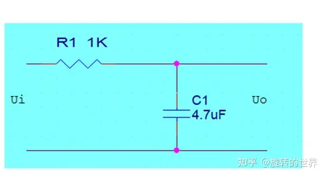

[TOC]


## 碎碎念：

在逆变器项目中已经很久了，基于大学本科时的才疏学浅，工作中遇到了很多问题，也学会了许多，思来想去想把工作中遇到的问题整理出来，供自己查阅及复习，如果后面有时间的情况下，能够将这些资料整理整理分享至知乎或CSDN。

​	所有的文档都会整理在这一个文档中，防止自己后面忘记找不到文档。

# 一、一阶低通滤波器原理及离散序列设计



由KVL方程知：
$$
V_i(t) = V_o(t) + R\cdot C\frac{dV_0(t)}{dt}   \tag{KVL公式}
$$
两端进行拉氏变换：
$$
\begin{align*}
&V_i(s) = V_o(s) + RC\cdot s\cdot V_o(s)    \\
&V_i(s) = (1 + RCs)\cdot V_o(s)				\\
由传递函数概念推出：&G(s) = \frac{V_o(s)}{V_i(s)} = \frac{1}{RCs + 1}
\end{align*}
$$
由惯性环节形式1：$\displaystyle G(s) = \frac{Y(s)}{X(s)} = \frac{1} {\tau s + 1} $                      可以看出时间常数$\tau = RC$

由惯性环节形式2：$\displaystyle G(s) = \frac{Y(s)}{X(s)} = \frac{\omega _c}{s + {\omega}_c}$					可以看出其截止角频率$\displaystyle {\omega}_c = \frac{1}{RC}$  

>注意：
>$$
>\begin{align*}
>截止频率：&{\color{red}{f_c =\frac{1}{2\pi RC} = \frac{{\omega}_c}{2 \pi} = \frac{1}{2{\pi}{\tau}}}} \tag{截止频率转换}\\
>&{\color{red}{\tau = RC}}
>\end{align*}
>$$
>

$$
离散化一般采用=\left\{
\begin{align*}
1、 & 后向差分法 \rightarrow \quad S = \frac{1 - Z^{-1}}{T_s} \\
2、 & 前向差分法 \rightarrow \quad S = \frac{Z - 1}{T_s}  \\
3、 & 双线性差分法\rightarrow S = \frac{2}{T_s}\frac{1 - Z^{-1}}{1 +Z^{-1}}
\end{align*}
\right.
$$

## 1、后向差分法

令$\displaystyle S = \frac{1 - Z^{-1}}{T_s}$，代入$\displaystyle G(s) = \frac{Y(s)}{X(s)} = \frac{{\omega}_c}{s + {\omega}_c}$
$$
\begin{align*}
得到:&\frac{Y(z)}{X(z)} = \frac{{\omega}_c}{\frac{1 - Z^{-1}}{T_s} +{\omega}_c} \quad  \quad \quad\quad\quad\quad\quad\quad\quad\quad\quad\quad  \\
通分:&\frac{Y(z)}{X(z)} = \frac{{\omega}_cT_s}{1 - Z^{-1} + {\omega}_cT_s}  \\
展开:&T_s{\omega}_cX(z) = (1 + {\omega}_cT_s)Y(z) - Y(z)Z^{-1}   \\
移项:&(1 + {\omega}_cT_s)Y(z) = T_s{\omega}_cX(z) + Y(z)Z^{-1}   \\
为了消&除(1 + {\omega}_C)并将其化简的更简洁,等式右边引入：  \\
&{\color{blue}{\omega}_c{T_s}Y(z)Z^{-1}-{\omega}_c{T_s}Y(z)Z^{-1}}   \\
\rightarrow &(1 + {\omega}_c{T_s})Y(z) = T{\omega}_cX(z) + (1 + {\omega}_c{T_s})Y(z)Z^{-1} -T_s{\omega}_c Y(z)Z^{-1}  \\
\rightarrow&(1 + {\omega}_c{T_s})Y(z) = T_s{\omega}_c(X(z) - Y(z)Z^{-1}) + (1 + {\omega}_cT_s)Y(z)Z^{-1}   \\
两边同&时除以：1 + T_s{\omega}_c     \\
&Y(z) = \frac{T_s{\omega}_c}{1 + T_s{\omega}_c}\cdot (X(z) - Y(z)Z^{-1}) + Y(z)Z^{-1}   \\
\end{align*}
$$

$$
引入离散采样数据:\left\{
\begin{align*}
1、 & 上一时刻 \rightarrow \quad Y(z)Z^{-1}  = y(n - 1) \\
2、 & 当前时刻 \rightarrow \quad Y(z)X^0 = y(n)  \\
3、 & 下一时刻 \rightarrow \quad Y(z)Z^1 = y(n + 1)    \rightarrow未使用
 \end{align*}
\right.
$$

得到：
$$
\begin{align*}
y(n) = y(n - 1) + \frac{T_s{\omega}_c}{(1 + T_s{\omega}_c)}[x(n) - y(n -1)]
\end{align*}
$$
程序中通常使用：
$$
\begin{align*}
y(n) = \frac{T_s{\omega}_c}{(1 + T_s{\omega}_c)}x(n) + (1 - \frac{T_s{\omega}_c}{(1 + T_s{\omega}_c)})y(n - 1)
\end{align*}
$$
程序中通常会算出两个变量：
$$
\begin{align}
&{\color{red}{A = \frac{T_s{\omega}_c}{(1 + T_s{\omega}_c)}}} \tag{}  \\
\label{eq公式1.1.1-1}&{\color{red}{B  =  1 -A}}   \tag{后向差分公式}   \\
&{\color{blue}{y(n) = A\cdot x(n) + By(n - 1)}}  \tag{}
\end{align}
$$

## 2、双线性差分法

令$\displaystyle S = \frac{2}{T}{\cdot}\frac{1 -Z^{-1}}{1 + Z^{-1}}$,代入$\displaystyle G(s) = \frac{Y(s)}{X(s)} = \frac{{\omega}_c}{s + {\omega}_c}$

得：
$$
\begin{align*}
\frac{Y(z)}{X(z)} = \frac{{\omega}_c}{\frac{2}{T_s}\cdot \frac{1 - Z^{-1}}{1 +Z^{-1}} + {\omega}_c}
\end{align*}
$$
通分：
$$
\begin{align*}
\frac{Y(z)}{X(z)} = \frac{{\omega}_c{T_s(1 + Z^{-1})}}{2(1 - Z^{-1}) + {\omega}_c{T_s{(1 +z^{-1})}}}
\end{align*}
$$
展开：
$$
\begin{align*}
{\omega}_cT_sX(z) + {\omega}_cT_sX(z)Z^{-1} = 2Y(z) - 2Y(z)Z^{-1} + {\omega}_cT_sY(z) + {\omega}_cT_sY(z)Z^{-1}
\end{align*}
$$
移相分配：
$$
\begin{align*}
(2 + {\omega}_cT_s)Y(z) = 2Y(z)Z^{-1} + {\omega}_cT_s(X(z) - Y(z)Z^{-1}) + {\omega}_cT_sX(z)Z^{-1}  \\
\end{align*}
$$
右边引入：$\displaystyle + {\omega}_cT_sY(z)Z^{-1} - {\omega}_cT_sY(z)Z^{-1} $
$$
\begin{align*}
(2 + {\omega}_cT_s)Y(z) = (2 + {\omega}_cT_s)Y(z)Z^{-1} + {\omega}_cT_s[(X(z) - Y(z)Z^{-1}) + (X(z)Z^{-1} - Y(z)Z^{-1})]
\end{align*}
$$
两边同除以$2 + {\omega}_cT_s$:
$$
\begin{align*}
Y(z) = Y(z)Z^{-1} + \frac{{\omega}_cT_s}{2 + {\omega}_cT_s}{\cdot}[(X(z) - Y(z)Z^{-1}) + (X(z)Z^{-1} - Y(z)Z^{-1})]
\end{align*}
$$

$$
引入离散采样数据:\left\{
\begin{align*}
1、 & 上一时刻 \rightarrow \quad Y(z)Z^{-1}  = y(n - 1) \\
2、 & 当前时刻 \rightarrow \quad Y(z)X^0 = y(n)  \\
3、 & 下一时刻 \rightarrow \quad Y(z)Z^1 = y(n + 1)    \rightarrow未使用
 \end{align*}
\right.
$$

得到：
$$
\begin{align*}
y(n) = y(n - 1) + \frac{{\omega}_cT_s}{2 + {\omega}_cT_s}{\cdot}[(x(n) - y(n - 1)) + (x(n-1) - y(n -1))]
\end{align*}
$$
化简系数:
$$
\begin{align*}
y(n) = (1 - \frac{2{\omega}_cT_s}{2 + {\omega}_cT_s})y(n - 1) + \frac{{\omega}_cT_s}{2 + {\omega}_cT_s}x(n) + \frac{{\omega}_cT_s}{2 + {\omega}_cT_s}x(n - 1)
\end{align*}
$$
程序中通常会算出两个变量：
$$
\begin{align}
&{\color{red}{A = (1 - \frac{2{\omega}_cT_s}{2 + {\omega}_cT_s})}}  \tag{}  \\  
\label{eq公式1.2.1-1}&{\color{red}{B = \frac{1 - A}{2}}}      \tag{双线性变化差分公式}   \\
&{\color{blue}{y(n) = Ay(n - 1) + Bx(n - 1) + Bx(n)}}      \tag{}
\end{align}
$$


我们的代码如下，算出了两个变量：

```C
#pragma CODE_SECTION(Alg_f32LPFCalc,"ramfuncs")
float32_t Alg_f32LPFCalc(FILTER_1ST_FRAME_T *RegAddr, float32_t f32DataIn)
{
    float32_t f32Out;
    f32Out = RegAddr->f32PreOut * RegAddr->f32A + RegAddr->f32B * f32DataIn + RegAddr->f32B * RegAddr->f32PreIn;
    RegAddr->f32PreOut = f32Out;			//这里用的是双线性差分变换的方式做的离散化
    RegAddr->f32PreIn = f32DataIn;       

    return f32Out;
}

void Alg_vFilterCoeffUpdate1st(FILTER_1ST_FRAME_T *RegAddrs)
{
    float32_t f32Omega;
    f32Omega = RegAddrs->f32Freq * 2.0f * PAI;
    RegAddrs->f32A = 1 / (f32Omega * RegAddrs->f32Period + 1);		//这里的系数代入的是后向差分法的系数
    RegAddrs->f32B = (1 - RegAddrs->f32A) * 0.5;
}
```

> 见上述代码所示$y(n) = A * y(n - 1) + B * x(n) + B * x(n - 1)$
>
> 理所当然得出：$A = (1 - \frac{2{\omega}_cT_s}{2 + {\omega}_cT_s})$
>
> ​				  		$ B = \frac{{\omega}_cT_s}{2 + {\omega}_cT_s}$
>
> 于是得到：$A = 1 - 2B$
>
> 神奇的是这里他没有采用$$\ref{eq公式1.2.1-1}$$ ，而是选择用$$\ref{eq公式1.1.1-1}$$代入运算，这里表示不理解，但又无可奈何。所以：
> $$
> \begin{align*}
> &{\color{blue}{A = \frac{1}{{\omega}_cT_s + 1}}}  \\
> &{\color{blue}{B = \frac{1 - A}{2}}}
> \end{align*}
> $$

下面给出了$$\ref{eq公式1.2.1-1}$$的代码：

```C 
void Alg_vBilinearFilterCoeffUpdate1st(FILTER_1ST_FRAME_T *RegAddrs)
{
    float32_t f32Omega;
    float32_t f32Tmp;

    f32Omega = RegAddrs->f32Freq * 2.0f * PAI;
    f32Tmp   = 2 - f32Omega * RegAddrs->f32Period;
    RegAddrs->f32A = f32Tmp / (f32Omega * RegAddrs->f32Period + 2);
    RegAddrs->f32B = (1 - RegAddrs->f32A) * 0.5;
}
```

# 二、 PID控制器

[PID算法(1) PID算法的原理推导1_pid控制推导-CSDN博客](https://blog.csdn.net/mayuxin1314/article/details/135217697?spm=1001.2014.3001.5502)

[经典位置式与增量式PID原理 (qq.com)](https://mp.weixin.qq.com/s/gtlW5khINFABqSxHTCMzkg)

[PID算法原理推导及应用 - 知乎 (zhihu.com)](https://zhuanlan.zhihu.com/p/704188968)

​		在编程中，Inc和Pos分别表示增量式和位置式的缩写。Inc通常是increment的缩写，表示增加或者递增的意思。Pos通常是position的缩写，表示位置的意思。

## 2.1 什么是PID

​		PID，即**比例Proportion**、**积分Integral**和**微分Derivative**三个单词的缩写。

​		闭环自动控制技术是**基于反馈的概念以减少不确定性**，在闭环自动控制原理中，我们把它叫做“PID控制器”，拿控制电机来说，参考下面模型：


下面引用一段网上经典的话：

> ​		在工业应用中PID及其衍生算法是应用最广泛的算法之一，是当之无愧的万能算法，如果能够熟练掌握PID算法的设计与实现过程，对于一般的研发人员来讲，应该是足够应对一般研发问题了，而难能可贵的是，在我所接触的控制算法当中，PID控制算法又是最简单，最能体现反馈思想的控制算法，可谓经典中的经典。经典的未必是复杂的，经典的东西常常是简单的，而且是最简单的，想想牛顿的力学三大定律吧，想想爱因斯坦的质能方程吧，何等的简单！简单的不是原始的，简单的也不是落后的，简单到了美的程度。

## 2.2 PID原理

​		常规的模拟 PID 控制系统原理框图如下：


该系统由模拟 PID 控制器和被控对象组成。

上面框图中， r(t) 是给定值， y(t) 是系统的实际输出值，给定值与实际输出值构成控制偏差e(t) = r(t) − y(t)。

**e(t)** 作为 PID 控制的输入， **u(t)**作为 PID 控制器的输出和被控对象的输入。所以模拟 PID 控制器的控制规律为:
$$
\begin{align*}
u(t) = K_p[e(t) + \frac{1}{T_i}\int^t_{0}e(t)dt+T_d\frac{de(t)}{dt}]
\end{align*}
$$
**三个重要的参数**：

​	**Kp**：控制器的比例系数。

​	**Ti**：控制器的积分时间，也称积分系数。

​	**Td**：控制器的微分时间，也称微分系数。


# 三、光伏最大功率点追踪（Maximum Power Point Tracking）

## 2.1 现有方案

​	现在的控制逻辑是先进行输入状态检查，然后是PV输入类型检查，看他们是不是并联输入，最后是每路PV追踪。我们先来看看现在的程序逻辑：

### 2.1.1 输入状态检查

初始化PV电压状态标志为低电压：在PwrMppt_vVarsInit()中做初始化。

> 1. 当直流开关处于闭合状态时：
>    - 如果电压低于最小限制电压减去20V，3s后，设置低电压状态标志，清除高电压状态标志，并重置相关计数器。
>    - 如果电压低于最小限制电压，立即清除高电压状态标志，12分钟后，设置低电压状态标志，并重置相关计数器。
>    - 如果电压高于最大限制电压，1s后，设置高电压状态标志，清除低电压状态标志，并重置相关计数器。
>    - 如果电压高于最大限制电压加上20V，立即设置高电压状态标志，清除低电压状态标志。
> 2. 当直流开关处于断开状态时：
>    - 如果电压低于启动工作电压，则设置低电压状态标志，清除高电压状态标志。
>    - 如果电压高于最大限制电压，则清除低电压状态标志，设置高电压状态标志。
> 3. 当电压状态标志被设置时，如果电压在工作范围内：
>    - 如果电压状态标志是高电压或低电压，立即清理高电压状态标志，10s后，清除高电压状态标志和低电压状态标志。

### 2.2.2 PV输入类型检查

​	最终的输出由三部分组成，MPPT电压控制使能、MPPT电流和MPPT跟随索引值。

先来看看MPPT电压控制使能判断：

- 

