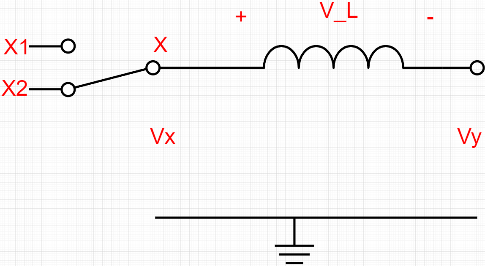
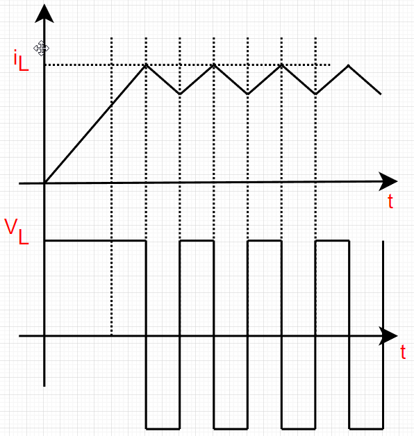
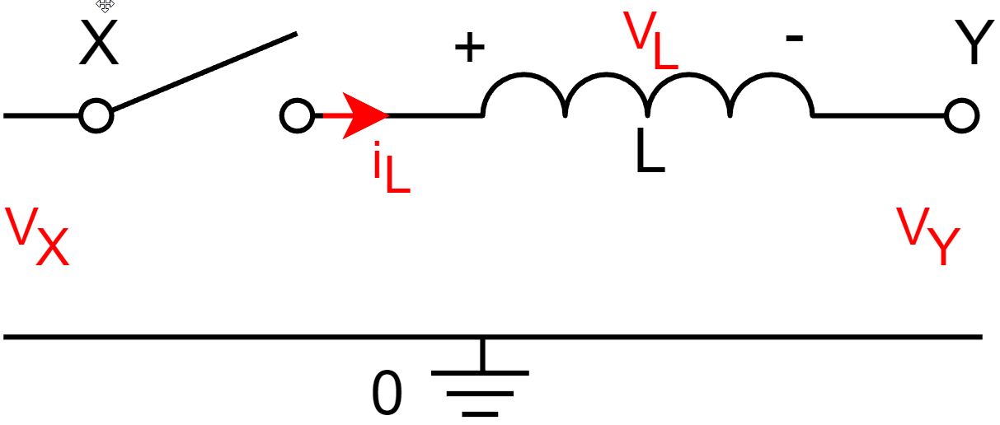

## 一、能量存储与传输器件

DC-DC功率变换电路利用能量存储器（电感器）件进行滤波，利用能量传输器（电容器）件来传输电能，以改变电压和电流的幅度。

### 1.1 电感器

​	参考创客皮特的电感基础系列文章：

- [电感基础1——为什么把‘线’绕成‘圈’就是电感？什么是电感？](https://zhuanlan.zhihu.com/p/149748238)
- [电感基础2——电感的单位、电压电流关系、时间常数和阻抗 ](https://zhuanlan.zhihu.com/p/149830125)
- [电感基础2——电感的单位、电压电流关系、时间常数和阻抗](https://zhuanlan.zhihu.com/p/149830125)
- [电感基础4——什么是LC电路的“谐振频率”？](https://zhuanlan.zhihu.com/p/156456031)
- [电感基础5——电感选型时需要考虑什么？额定电流、饱和电流、自谐振频率……](https://zhuanlan.zhihu.com/p/157376214)

### 1.2 电容器

​	参考创客皮特的电感基础系列文章：

- [电容基础1——储能和滤波](https://zhuanlan.zhihu.com/p/145810291)
- [电容基础2——充放电时间常数](https://zhuanlan.zhihu.com/p/146297149)
- [电容基础3——阻抗和容抗](https://zhuanlan.zhihu.com/p/146444827)
- [电容基础4——电容种类和ESR（等效串联电阻），超级电容能否代替电池？](https://zhuanlan.zhihu.com/p/148037515)
- [电容基础5——RC低通滤波器和RC高通滤波器 ](https://zhuanlan.zhihu.com/p/148159402)

### 1.3  磁通平衡与伏秒平衡、电荷平衡与安秒平衡！

请参考：[1 磁通平衡与伏秒平衡、电荷平衡与安秒平衡！ - 知乎 (zhihu.com)](https://zhuanlan.zhihu.com/p/349733079)

## 二、 单电感统一模型

### 2.1 基本理论

核心思想：有且仅有、降本增效

主要的非隔离型DCDC变换器分为两类，单电感模型、双电感模型

​                                                                                                                            单电感模型

电感的公式：$V_L = L\frac{di_L}{dt}$      $\rightarrow$     $\Delta i_L = \frac{1}{L} \int_{0}^{T}V_Ldt$

​	由上式可知：电流为电压的积分，电压可以突变，电流不能突变

​	对于一个稳定的系统，稳定后电感要处于平衡状态，即一个周期T内电感的电流变化量要为0，否则会一直上升或下降，从而脱离平衡状态（详见1.3节）。

电感电流、电压在一个周期T内的变化如图所示，也就是电感两端电压的积分为0，意味着稳定后电感电压的平均值为0

​                                                                                                         $V_{avg} = \frac{1}{T} \int_{0}^{T}V_Ldt$

对于单电感模型：$arg(V_L)==0  \rightarrow  arg(V_X-V_Y)==0  \rightarrow  arg(V_X)==arg(V_Y)$

​	[两个端子时](#两个端子)：$arg(V_X)==arg(V_Y)     \rightarrow   $           $V_X == V_Y$

​	[三个端子时](#三个端子)：$arg(V_{X1},V_{X2})==arg(V_Y) == V_Y$

​						$V_{avg} = \frac{1}{T}(\int_{0}^{T_{X1}}V_{X1}dt + \int_{0}^{T_{X2}}V_{X2}dt)  =\frac{1}{T}\int_{0}^{T_Y}dt$

​				$\Rightarrow \int_{0}^{T_{X1}}V_{X1} = \int_{0}^{V_{X2}}V_{X2}dt = \int_{o}^{T}V_Ydt$

​	    		$\Rightarrow T_{X1}V_{X1} + T_{X2}V_{X2} = T_YV_Y$     ($T = T_Y = T_{X1} + T_{X2}$)

当时间全部作用在$V_{X1}$上时：$T_YV_{X1}=T_YV_Y   \Rightarrow V_Y = V_{X1}$

当时间全部作用在$V_{X2}$上时：$T_YV_{X2}=T_YV_Y  \Rightarrow  V_Y = V_{X2}$

​				所以对于单电感模型来说：$V_Y$必然介于$V_{X1}$和$V_{X2}$之间。

​				对于单电感DCDC变换器来说，有三个电平0、$V_{in}$、$V_{out}$。所以有且仅有三种可能：

|       |        $V_X$        |   $V_Y$   |              备注              |
| :---: | :-----------------: | :-------: | :----------------------------: |
| 端口  |    $X_1$、$X_2$     |    $Y$    |                                |
| 类型1 |     0，$V_{in}$     | $V_{out}$ |    $0<V_{out}<V_{in}$，Buck    |
| 类型2 |    0，$V_{out}$     |  $V_in$   |   $0<V_{in}<V_{out}$，Boost    |
| 类型3 | $V_{in}$，$V_{out}$ |     0     | $V_{out}<0<V_{in}$，Buck-Boost |

​				

​																													两个端子

三个端子

