## 一、能量存储与传输器件

DC-DC功率变换电路利用能量存储器（电感器）件进行滤波，利用能量传输器（电容器）件来传输电能，以改变电压和电流的幅度。

### 1.1 电感器

​	参考创客皮特的电感基础系列文章：

- [电感基础1——为什么把‘线’绕成‘圈’就是电感？什么是电感？](https://zhuanlan.zhihu.com/p/149748238)
- [电感基础2——电感的单位、电压电流关系、时间常数和阻抗 ](https://zhuanlan.zhihu.com/p/149830125)
- [电感基础2——电感的单位、电压电流关系、时间常数和阻抗](https://zhuanlan.zhihu.com/p/149830125)
- [电感基础4——什么是LC电路的“谐振频率”？](https://zhuanlan.zhihu.com/p/156456031)
- [电感基础5——电感选型时需要考虑什么？额定电流、饱和电流、自谐振频率……](https://zhuanlan.zhihu.com/p/157376214)

### 1.2 电容器

​	参考创客皮特的电感基础系列文章：

- [电容基础1——储能和滤波](https://zhuanlan.zhihu.com/p/145810291)
- [电容基础2——充放电时间常数](https://zhuanlan.zhihu.com/p/146297149)
- [电容基础3——阻抗和容抗](https://zhuanlan.zhihu.com/p/146444827)
- [电容基础4——电容种类和ESR（等效串联电阻），超级电容能否代替电池？](https://zhuanlan.zhihu.com/p/148037515)
- [电容基础5——RC低通滤波器和RC高通滤波器 ](https://zhuanlan.zhihu.com/p/148159402)

### 1.3  磁通平衡与伏秒平衡、电荷平衡与安秒平衡！

请参考：[1 磁通平衡与伏秒平衡、电荷平衡与安秒平衡！ - 知乎 (zhihu.com)](https://zhuanlan.zhihu.com/p/349733079)

## 二、 单电感统一模型

### 2.1 基本理论

核心思想：有且仅有、降本增效

主要的非隔离型DCDC变换器分为两类，单电感模型、双电感模型

​                                                                                                                            单电感模型-三个端子

​                                                                                                                         	*单电感模型-两个端子*

电感的公式：$V_L = L\frac{di_L}{dt}$      $\rightarrow$     $\Delta i_L = \frac{1}{L} \int_{0}^{T}V_Ldt$

​	由上式可知：电流为电压的积分，电压可以突变，电流不能突变

​	对于一个稳定的系统，稳定后电感要处于平衡状态，即一个周期T内电感的电流变化量要为0，否则会一直上升或下降，从而脱离平衡状态（详见1.3节）。

电感电流、电压在一个周期T内的变化如图所示，也就是电感两端电压的积分为0，意味着稳定后电感电压的平均值为0

​                                                                                                         $V_{avg} = \frac{1}{T} \int_{0}^{T}V_Ldt$

对于单电感模型：$arg(V_L)==0  \rightarrow  arg(V_X-V_Y)==0  \rightarrow  arg(V_X)==arg(V_Y)$

​	[两个端子时](#两个端子)：$arg(V_X)==arg(V_Y)     \rightarrow   $           $V_X == V_Y$

​	[三个端子时](#三个端子)：$arg(V_{X1},V_{X2})==arg(V_Y) == V_Y$

​						$V_{avg} = \frac{1}{T}(\int_{0}^{T_{X1}}V_{X1}dt + \int_{0}^{T_{X2}}V_{X2}dt)  =\frac{1}{T}\int_{0}^{T_Y}dt$

​				$\Rightarrow \int_{0}^{T_{X1}}V_{X1} = \int_{0}^{V_{X2}}V_{X2}dt = \int_{o}^{T}V_Ydt$

​	    		$\Rightarrow T_{X1}V_{X1} + T_{X2}V_{X2} = T_YV_Y$     ($T = T_Y = T_{X1} + T_{X2}$)

当时间全部作用在$V_{X1}$上时：$T_YV_{X1}=T_YV_Y   \Rightarrow V_Y = V_{X1}$

当时间全部作用在$V_{X2}$上时：$T_YV_{X2}=T_YV_Y  \Rightarrow  V_Y = V_{X2}$

​				所以对于单电感模型来说：$V_Y$必然介于$V_{X1}$和$V_{X2}$之间。

​				对于单电感DCDC变换器来说，有三个电平0、$V_{in}$、$V_{out}$。所以有且仅有三种可能：

|       |        $V_X$        |   $V_Y$   |              备注              |
| :---: | :-----------------: | :-------: | :----------------------------: |
| 端口  |    $X_1$、$X_2$     |    $Y$    |                                |
| 类型1 |     0，$V_{in}$     | $V_{out}$ |    $0<V_{out}<V_{in}$，Buck    |
| 类型2 |    0，$V_{out}$     |  $V_in$   |   $0<V_{in}<V_{out}$，Boost    |
| 类型3 | $V_{in}$，$V_{out}$ |     0     | $V_{out}<0<V_{in}$，Buck-Boost |

### 2.2 三种基本电路

​				单电感模型如下图示：

#### 2.2.1 buck电路（0 < $V_{out}$ < $V_{in}$）

​	根据单电感模型设计：$V_Y$必然介于$V_{X1}$和$V_{X2}$之间，当$0 < V_{out} < V_{in}$ 时

开关管有MOSFET、IGBT等，选用开关管进行填充	

​	只考虑能量单向流动，可以用续流二极管（便宜）代替开关管，根据能量流动分析，只有如下情况符合设计逻辑：

由单电感统一模型的结论$\Rightarrow T_{X1}V_{X1} + T_{X2}V_{X2} = T_YV_Y$     ($T = T_Y = T_{X1} + T_{X2}$)

对于开关管：$T = T_{on} + Y_{off}$

​						$d = \frac{T_{on}}{T}$

在连续状态下，计算输出电压和输入电压的比例关系：$\Rightarrow T_{X1}V_{X1} + T_{X2}V_{X2} = T_YV_Y$ 

​																							$\Rightarrow dT\cdot V_{in} + 0\cdot \frac{(1 -d)}{T} = V_{out}\cdot T$

​																							$\frac{V_{out}}{V_{in}} = d$

电路输出分析：

​	开关管闭合时，

#### 2.2.2 Boost电路（0 < $V_{in}$ < $V_{in}$)

根据单电感模型设计：$V_Y$必然介于$V_{X1}$和$V_{X2}$之间，当$0 < V_{out} < V_{in}$ 时

为适应正常情况下左侧输入，右侧输出的看图习惯，并用开关管进行填充：

只考虑能量单向流动，可以用续流二极管（便宜）代替开关管，根据能量流动分析，只有如下情况符合设计逻辑：

在连续状态下，计算输出电压和输入电压的比例关系：$\Rightarrow T_{X1}V_{X1} + T_{X2}V_{X2} = T_YV_Y$ 

​																							$\Rightarrow V_{in}\cdot T = dT\cdot 0 + (1-d)T\cdot V_{out}$

​																							$\frac{V_{out}}{V_{in}} = \frac{1}{1-d}$

#### 2.2.3 Buck-Boost电路($V_{out} < 0 < V_{in}$)

根据单电感模型设计：$V_Y$必然介于$V_{X1}$和$V_{X2}$之间，当$V_{out} < 0 < V_{in}$时，由此可知$V_{out}$和$V_{in}$是反向的。,

根据看图习惯，改为一边输入，一边输出，并用开关管进行填充：

只考虑能量单向流动，可以用续流二极管（便宜）代替开关管，根据能量流动分析，只有如下情况符合设计逻辑：

在连续状态下，计算输出电压和输入电压的比例关系：$\Rightarrow T_{X1}V_{X1} + T_{X2}V_{X2} = T_YV_Y$ 

​																							$\Rightarrow dT\cdot V_{in} - (1 - d)T\cdot V_{out} = 0$

​																							$\frac{V_{out}}{V_{in}} = \frac{d}{1-d}$

当$d < 0.5$时： $\frac{V_{out}}{V_{in}} < 1$     $\rightarrow$  $V_{out} < V_{in}$   $\rightarrow$ Buck电路

当$d > 0.5$时： $\frac{V_{out}}{V_{in}} > 1$     $\rightarrow$  $V_{out} > V_{in}$   $\rightarrow$ Boost电路

## 三、 双电感统一模型

### 3.1 基本理论

​	双电感统一模型实际上就是把两个单电感统一模型相互连接在一起了，怎么将两个电感串联起来还不影响单电感统一模型的结论呢？最终选择用一个电容$C_f$将两个电感隔开。$C_f$上的电流可以突变，但是电压不能突变，正好和电感相反，所以可以通过它调节换态后的电流方向。

​	双电感统一模型的电路图如下：

​	我们把整体当作两个单电感统一模型来逐一分析：

对于$L_1$：B点相当于[单电感统一模型](#三个端子)的X端，A点相当于Y端，根据单电感统一模型的结论：$T_{x1}V_{x1} + T_{x2}V_{x2} = T_yV_y (T = T_y = Y_{x1} + T_{x2})$

​	对于单电感统一模型，由于电感特性，要保证电感磁通平衡，也就是A端和B端的平均电压要相等。

​				得到$L_1$两端平均电压计算公式：$dT\cdot V_B + (1-d)T\cdot (V_C + V_f) = V_A\cdot T$                                                             

​												       化简得：$V_A = d\cdot V_B + (1-d)\cdot (V_C + V_f)$                                                       [ 1式](#1式)

对于$L_2$：C点相当于[单电感统一模型](#三个端子)的X端，D点相当于Y端，根据单电感统一模型的结论：$T_{x1}V_{x1} + T_{x2}V_{x2} = T_yV_y (T = T_y = Y_{x1} + T_{x2})$

​	对于单电感统一模型，由于电感特性，要保证电感磁通平衡，也就是C端和D端的平均电压要相等。

​				得到$L_2$两端平均电压计算公式：$dT\cdot (V_B - V_f) + (1-d)T\cdot V_C = V_D\cdot T$                                                             

​												       化简得：$V_D = d\cdot (V_B - V_f) + (1-d)\cdot V_C$                                                       [ 2式](#1式)

​	[  1式](#1式)展开：$V_A = dV_B + V_C + V_f - dV_C - dV_f$

​	[  2式](#1式)展开：$V_D = dV_B -dV_f + V_C -dV_C$

​	观察后继续化简[1式](#1式)：$V_A = dV_B - dV_f + V_C - dV_C + V_f$

  [ 1式](#1式) - [ 2式](#1式)得：$V_A - V_D = V_f$															                                               							[3式](#3式)

将[3式](#3式)代入[ 1式](#1式)或[ 2式](#1式)得：$V_A = dV_B + V_C + V_A - V_D -dV_C - dV_A+ dV_D$

​							 			 $dV_A - dV_B = V_C - V_D - dV_C + dV_D$

​					     			   $d(V_A - V_B) = (1-d)V_C - (1 - d)V_D$ 

​				    			得： $d(V_A - V_B) = (1 - d)(V_C - V_D)$	                                                                                     [3式](#3式)

接下来就是把$0 、 V_{in} 、 V_{out}$分配到A、B、C、D这四个位置上去，四个位置分配三个电压，意味着肯定有两个点位是相同的，不妨设相同的点位为$V_{x1}$,剩下两个分别是$V_{x2}、V_{x3}$,在分配时要注意以下几点：

1. A点 $\neq$ B点
2. C点 $\neq$ D点
3. A点 $\neq$ D点

> 具体原因如下：
>
> 1. A点 $\neq$ B点
>
>    将$L_1$当作一个单电感统一模型分析，A点相当于Y端，B点相当于X端，根据电感磁通平衡条件可知$V_A = d\cdot V_B + (1-d)\cdot (V_C + V_f)$
>
>    若$V_A = V_B$，意味着$d = 1$，此时明显不符合电感磁通平衡条件，所以说A点 $\neq$ B点。
>
> 2. C点 $\neq$ D点
>
> ​	  将$L_2$ 当作一个单电感统一模型分析，C点相当于X端，D端相当于Y端，根据电感磁通平衡条件可知$V_D = d\cdot (V_B - V_f) + (1-d)\cdot V_C$
>
> ​	  若$V_C = V_D$，意味着d = 0，此时明显不符合电感磁通平衡条件，所以说C点 $\neq$ D点
>
> 3. A点 $\neq$ D点
>
>    由电感磁通平衡条件可知$avg(V_A) = avg(V_B)$、$avg(V_C) = avg(V_D)$，代入[3式](#3式)（$V_A - V_D = V_f$）结论得到$(V_B - V_C = V_f)$,若$V_A = V_D$,则相当于两个电感之间是通过导线连接，不符合双电感统一模型基本理论。

遵循上述分配注意点，分配情况有如下六种：

|    A     |    B     |    C     |    D     |
| :------: | :------: | :------: | :------: |
| $V_{x1}$ | $V_{x2}$ | $V_{x1}$ | $V_{x3}$ |
| $V_{x1}$ | $V_{x3}$ | $V_{x1}$ | $V_{x2}$ |
| $V_{x3}$ | $V_{x1}$ | $V_{x2}$ | $V_{x1}$ |
| $V_{x2}$ | $V_{x1}$ | $V_{x3}$ | $V_{x1}$ |
| $V_{x2}$ | $V_{x1}$ | $V_{x1}$ | $V_{x3}$ |
| $V_{x3}$ | $V_{x1}$ | $V_{x1}$ | $V_{x2}$ |

有双电感统一模型可知，它是由两个单电感统一模型经过一个电容连接在一起的，所以说双电感统一模型关于电容两边是对称，根据单电感模型有三种电压分配情况，也就是说双电感统一模型每种类型也有三种分配方式，所以上述分配情况根据对称性可简化为如下情况：

|        |    A     |   B(d)   |  C(1-d)  |    D     | 组合数M |
| :----: | :------: | :------: | :------: | :------: | :-----: |
| 类型一 | $V_{x1}$ | $V_{x2}$ | $V_{x1}$ | $V_{x3}$ |    3    |
| 类型一 | $V_{x1}$ | $V_{x3}$ | $V_{x1}$ | $V_{x2}$ |    3    |
| 类型二 | $V_{x2}$ | $V_{x1}$ | $V_{x1}$ | $V_{x3}$ |    3    |

详细的分配方式及电路名称见下表：

|        |     A     |   B(d)    |  C(1-d)   |     D     |    类型    |
| :----: | :-------: | :-------: | :-------: | :-------: | :--------: |
| 类型一 |     0     | $V_{in}$  |     0     | $V_{out}$ |    ZETA    |
| 类型一 |     0     | $V_{out}$ |     0     | $V_{in}$  |   SEPIC    |
| 类型一 | $V_{in}$  |     0     | $V_{in}$  | $V_{out}$ | Semi-Z INV |
| 类型一 | $V_{in}$  | $V_{out}$ | $V_{in}$  |     0     | Semi-Q INV |
| 类型一 | $V_{out}$ | $V_{in}$  | $V_{out}$ |     0     |   New#1    |
| 类型一 | $V_{out}$ |     0     | $V_{out}$ | $V_{in}$  |   New#2    |
| 类型二 | $V_{in}$  |     0     |     0     | $V_{out}$ |    Cuk     |
| 类型二 |     0     | $V_{in}$  | $V_{in}$  | $V_{out}$ | Boost(new) |
| 类型二 |     0     | $V_{out}$ | $V_{out}$ | $V_{in}$  | Buck(new)  |

### 3.2 基本电路

#### 3.2.1 ZETA电路

​	将ZETA类型的电位填补到双电感统一模型中去，电路如下：

根据电源侧能量流动的方向来决定开关方向，用开关管经行填充，将其变左侧输入、右侧输出的形式：

只考虑能量单向流动，为了降本增效，可以用续流二极管（便宜）代替开关管，根据能量流动分析，只有如下情况符合设计逻辑：

在连续状态下，计算输出电压和输入电压的比例关系：$\Rightarrow d\cdot (V_A - V_B) = (1-d)(V_C - V_D)$

​													  代入实际的点位关系：$\Rightarrow d\cdot (0 - V_{in}) = (1 -d)(0 - V_{out})$

​																							$\Rightarrow \frac{V_{out}}{V_{in}} = \frac{d}{1-d}$	       Buck-Boost电路

当$d < 0.5$时： $\frac{V_{out}}{V_{in}} < 1$     $\rightarrow$  $V_{out} < V_{in}$   $\rightarrow$ Buck电路

当$d > 0.5$时： $\frac{V_{out}}{V_{in}} > 1$     $\rightarrow$  $V_{out} > V_{in}$   $\rightarrow$ Boost电路

注：ZETA是Buck-Boost电路，且输出电流连续，输入电流不连续，所以输出好滤波，输入不好滤波，且输出电压是正极性。

**输出电流连续性分析：**

> ​	二极管闭合时，$V_{in}$提供电压，$L_1$电流不能突变，开始继续能量。$C_f$开始充电，电容两边电压相等时，给$L_2$提供电压，最终输出侧$V_{out}$有电流流过。电流流动方向如图：
>
> ​	二极管断开时，$L_1$电流不能突变，向二极管提供能量，电容开始放电。$L_2$电流也不能突变，也开始向二极管释放能量，输出侧有电流。电流流动方向如图：
>
> 
>
> ​	根据上述分析可以看出，ZETA电路的输出电流是连续的，相对于单电感统一模型，该电路的输出更稳定，能更好的滤波。

**输出同电压方向及电路类型分析：**

> 方式一、	由输出与输入电压比例关系：$\frac{V_{out}}{V_{in}} = \frac{1}{1-d}$
>
> ​									得到$\Rightarrow V_{out}与V_{in}$同向
>
> 方式二、利用$V_{out}$的输出范围分析
>
> ​	由单电感统一模型可知：$V_Y$必然介于$V_{X1}$和$V_{X2}$
>
> ​	对于$L_2$:$0 < V_{out} < (V_{in} - V_f)$ 
>
> ​			又：$v_f = V_{A} - V_D$                                     ZETA电路的$V_A = 0$
>
> ​			则：$0 < V_{out} < V_{in} + V_{out}$
>
> ​			一般情况下，$V_{in} > 0$,那么必然$V_{out} > 0$，$V_{in}$与$V_{out}$同向。而且$V_{out}$既可以大于$V_{in}$，也可以小于$V_{in}$，所以 此电路为Buck-Boost电路.
>
> ​	对于L1：$ V_{in} < 0 < 0 + V_f$
>
> ​			又：$v_f = V_{A} - V_D$                                     ZETA电路的$V_A = 0$，$V_D = V_{out}$
>
> ​			则：$V_{in} < 0 < - V_{out}$                                两边同乘以-1得$-V_{out} < 0 < V_{in}$
>
> ​			一般情况下，$V_{in} > 0$,那么$V_{out} > 0$时等式才能成立,故$V_{in}$与$V_{out}$同向。而且$V_{out}$既可以大于$V_{in}$，也可以小于$V_{in}$，所以 此电路为Buck-Boost电路.

**分析一下两个Buck-Boost电路开关管和二极管得耐压关系：**

单电感模型Buck-Boost电路：

开关导通：

​				二极管承受的电压			$\rightarrow V_{in} + V_{out}$

开关关断：

​				开关管承受得电压				$\rightarrow V_{in} + V_{out}$

单电感模型Buck-Boost电路：

开关导通：

​				二极管承受的电压				$\rightarrow V_{in} - V_f = V_{in} - (0 - V_{out}) = V_{in} + V_{out}$

开关断开：

​				开关管承受的电压				$\rightarrow V_{in} - V_f = V_{in} - (0 - V_{out}) = V_{in} + V_{out}$

电感和二极管选取时，电压和电流都要预留1.5-2倍得余量，以防止过流。电流的选择是电路峰值电流得1.5-2倍。

#### 3.2.2 SEPIC电路

将SEPIC电路的电位填补到双电感统一模型中去，电路模型如下：

为更直观的分析电路，将输出变为负载，再根据输入侧在左、输出侧在右的形式变换电路图：

因一般把可控开关作用的时间和周期的比值取占空比，此时根据电流流向分析，$V_c$点的开关是可控的d，所以$V_b$就是$1-d$，由于双电感统一模型是关于电容$C_f$对称的，所以说反一下也没有问题。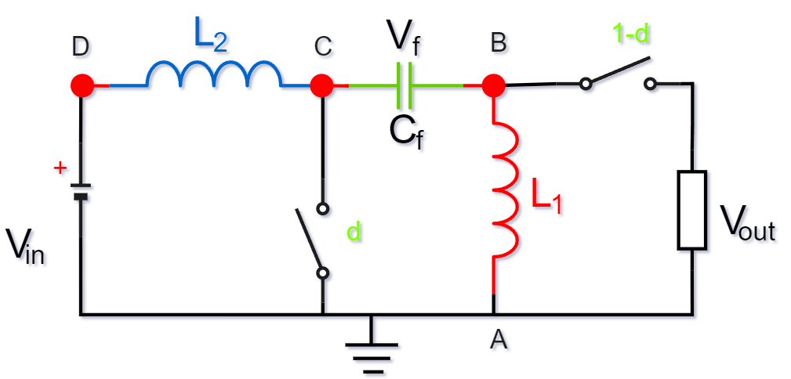

根据电源侧能量流动情况来分析开关的方向，利用续流二极管代替其中一个开关管(降本增效)，用开关管和续流二极管填充：

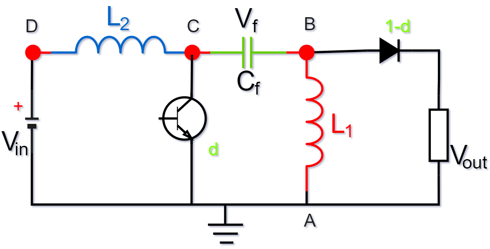

**电流流动情况分析：**

​	开关管闭合时：由电流的方向可知，此时输出侧是没有电流流过的。

​	开关管承受的电压：$V_{in} + V_{out}$

 >电容的特性是隔直通交，此时电容上没有电流流过，电容呈现左正右负的电压特性，通过开关管和电感$L_1$形成闭合的回路。从这里也可看出输出端无电流。

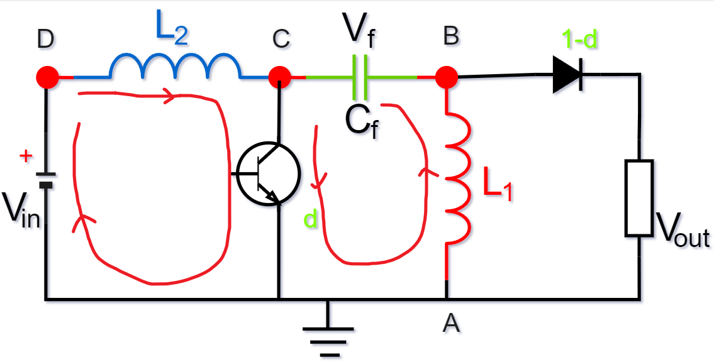

​	开关管断开时：由电流方向可知，此时输出$V_out$是有电流产生的。

> 之前开关管闭合时，给电容充电，当开关管断开时，输入$Y_{in}$和电感$L_2$给$V_f$充电，且当电源向输出释放能量，$L_1$也向负载输出能量。

由以上分析可知，SEPIC电路的输出也是不连续的，但是输入的电流是经过电感的脉动比较小。

**输出比例关系推导**

在连续状态下，计算输出电压和输入电压的比例关系：$\Rightarrow d\cdot (V_C - V_D) = (1-d)(V_A - V_B)$

​													  代入实际的点位关系：$\Rightarrow d\cdot (0 - V_{in}) = (1 -d)(0 - V_{out})$

​																							$\Rightarrow \frac{V_{out}}{V_{in}} = \frac{d}{1-d}$	       Buck-Boost电路

当$d < 0.5$时： $\frac{V_{out}}{V_{in}} < 1$     $\rightarrow$  $V_{out} < V_{in}$   $\rightarrow$ Buck电路

当$d > 0.5$时： $\frac{V_{out}}{V_{in}} > 1$     $\rightarrow$  $V_{out} > V_{in}$   $\rightarrow$ Boost电路

注：SEPIC是Buck-Boost电路，且输入电流连续，输出电流不连续，所以输入好滤波，输出不好滤波，且输出电压是正极性。

**输出极性分析**

> 方式一、	由输出与输入电压比例关系：$\frac{V_{out}}{V_{in}} = \frac{1}{1-d}$
>
> ​									得到$\Rightarrow V_{out}与V_{in}$同向
>
> 方式二、利用$V_{out}$的输出范围分析
>
> ​	由单电感统一模型可知：$V_Y$必然介于$V_{X1}$和$V_{X2}$
>
> ​	对于$L_2$:$0 < V_{in} < (V_f - V_{out})$ 
>
> ​			又：$v_f = V_{A} - V_D$                                     ZETA电路的$V_A = 0$
>
> ​			则：$0 < V_{in} < V_{out} - V_{in}$
>
> ​			一般情况下，$V_{in} > 0$,那么必然$V_{out} > 0$，$V_{in}$与$V_{out}$同向。而且$V_{out}$既可以大于$V_{in}$，也可以小于$V_{in}$，所以 此电路为Buck-Boost电路.
>
> ​	对于L1：$ V_{out} < 0 <  V_f$
>
> ​			又：$v_f = V_{A} - V_D$                                     ZETA电路的$V_A = 0$，$V_D = V_{in}$
>
> ​			则：$V_{out} < 0 < - V_{in}$                                两边同乘以-1得$-V_{out} < 0 < V_{in}$
>
> ​			一般情况下，$V_{in} > 0$,那么$V_{out} > 0$时等式才能成立,故$V_{in}$与$V_{out}$同向。而且$V_{out}$既可以大于$V_{in}$，也可以小于$V_{in}$，所以 此电路为Buck-Boost电路.

#### 3.2.3 Semi-Z INV电路

将Semi-Z INV电路的电位填补到双电感统一模型中去，电路模型如下：

为了直观的分析电路，将输出用负载代替，再根据输入侧在左、输出侧在右的形式变换电路图：

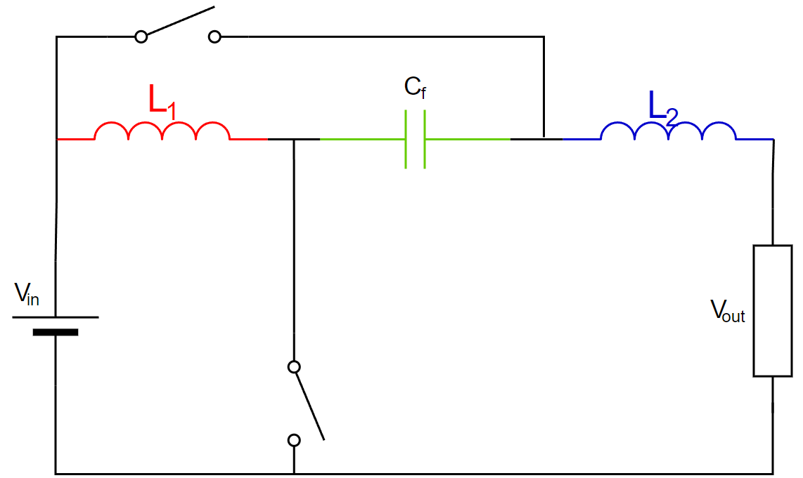

根据电源侧能量流动情况来分析开关的方向，发现最后没有必要用二极管的形式去填充，下面来看一下两个开关通断情况下的电路图。

​	B点开关管闭合，C点开关管断开时：此时不能用续流二极管代替

​	C点开关管闭合，B点开关管断开时：此时电流也会从开关管流过，所以也不能用二极管代替开关管

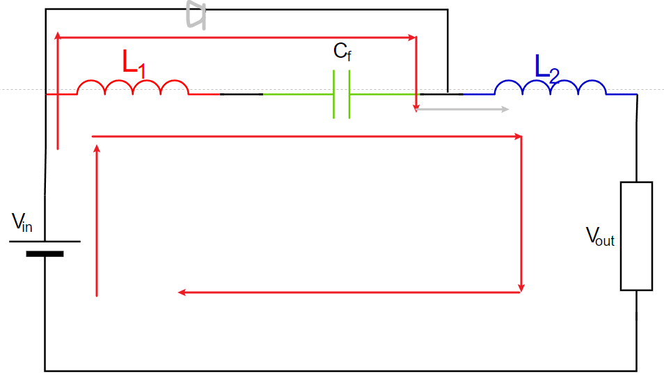

下面用通式的角度分析一下电路：$d(V_A - V_B) = (1 -d)(V_C - V_D)$

​           代入Semi-Z INV电路电位:   $d(V_{in} - 0) = (1 - d)(V_{in} - V_{out})$

​                                          化简得：$\frac{V_{out}}{V_{in}} = 1 + \frac{d}{d - 1}$

> 若d = 0.5   则$\frac{V_{out}}{V_{in}} = 0$
>
> 若d < 0.5    则$\frac{V_{out}}{V_{in}} > 0$
>
> ​	设d = 0.1   得$\frac{V_{out}}{V_{in}} = 1 + \frac{0.1}{-0.9} = \frac{8}{9}$
>
> 若d > 0.5    则$\frac{V_{out}}{V_{in}} < 0$
>
> ​	设的= 0.9	得$\frac{V_{out}}{V_{in}} = 1 + \frac{0.9}{-0.1} = -8$ 

从另一个角度分析电路：

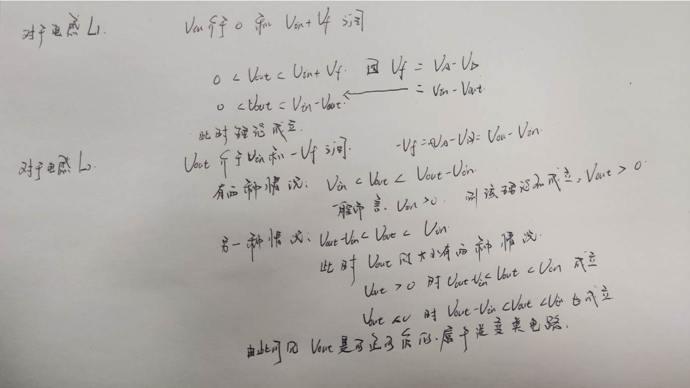

由以上分析情况可知，该电路的输出是可正、可负，所以他应该属于逆变电路的一种。由前面的电路分析可知，双电感统一模型是关于电容对称的，可以肯定Semi-Q电路也是逆变类电路，所以这两种电路该处不做深究。

#### 3.2.4 New#1电路

将New#1电路的电位补充到双电感统一模型中去，电路模型如下：

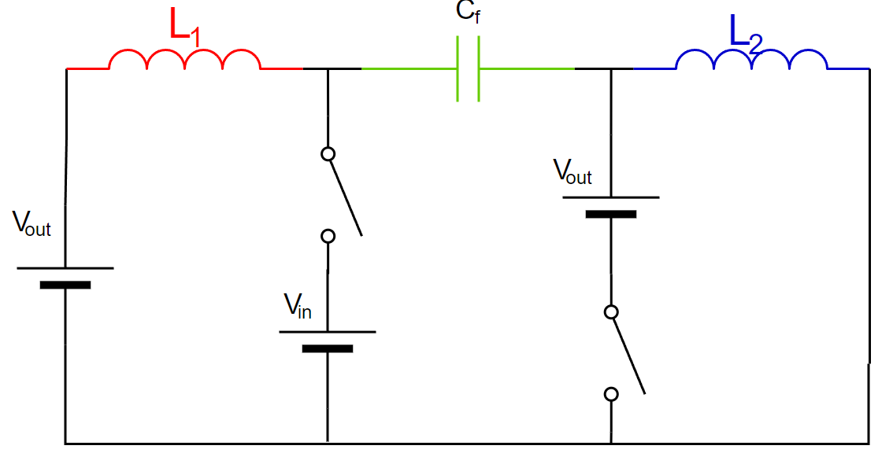

由于电路的特殊性，我们直接用通式角度分析电路：$d(V_A - V_B) = (1 - d)(V_C - V_D)$

代入New#1电路的电位：$d(V_{out} - V_{in}) = (1 - d)(V_{out} - 0)$

化简得：$\frac{V_{out}}{V_{in}} = \frac{d}{2d - 1}$

下面是该函数得函数图形（用https://www.desmos.com/calculator?lang=zh-CN绘制）：

分析函数图形可知：

​	0.5 < d < 1时，$2d - 1 > 0$，且$d > 2d - 1$,所以此时电路为Boost电路，且输入输出同向；

​	$0 < d < 0.5$时，$2d - 1 < 0$,证明$V_{out < 0}$，且$\frac{V_{out}}{V_{in}}$可能大于-1，也可能小于-1，所以此时为Buck-Boost电路($0$到$\frac{1}{3}$为Buck，$\frac{1}{3}到0.5$为Boost)。	

​	比值有正有正、有负，所以该电路类型也是类似于逆变类电路，根据双电感统一模型对称性可知，另一种电路也是类似的逆变类电路，这里不做进一步的深入分析。

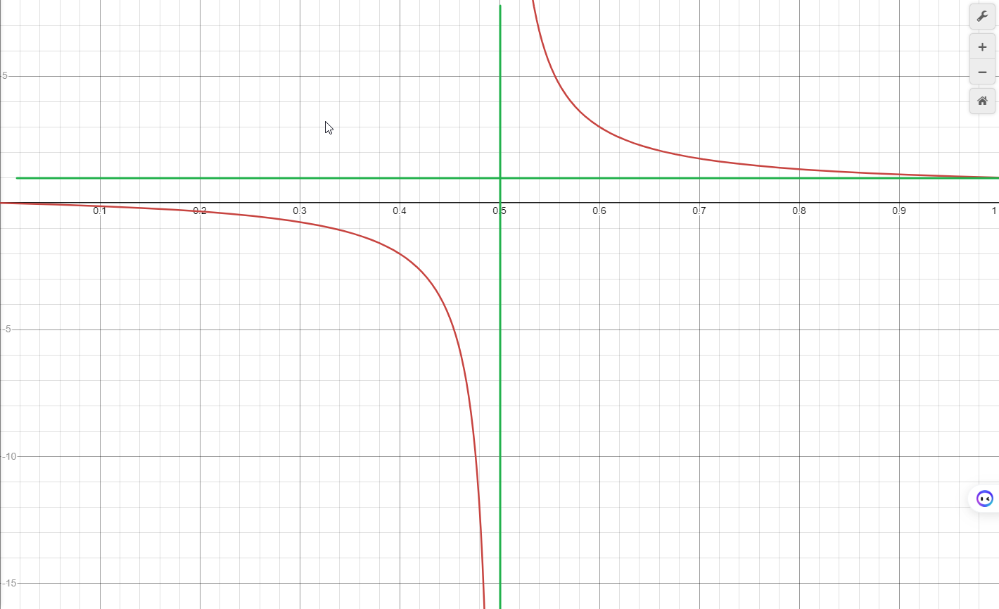

#### 3.2.5 Cuk电路

将Cuk电路的电位填充到双电感统一模型中去，为了直观的分析电路，用负载代替输出，电路模型如下：

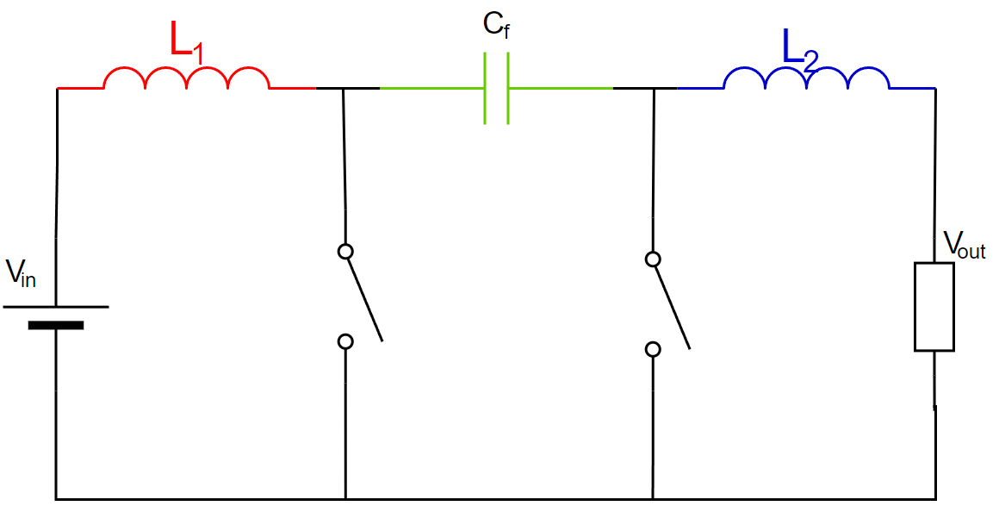

**首先用通式的方式去分析电路：**$d(V_A - V_B) = (1 - d)(V_C - V_D)$

​                代入Cuk电路的电位：$d(V_{in} - 0) = (1 - d)(0 - V_{out})$

​                                          展开：$d \cdot V_{in} = -V_{out} \cdot (1 - d)$

​				  	                化简得：$\frac{-V_{out}}{V_in}= \frac{d}{1 - d}$

> 因为d的取值范围为0~1，所以说$\frac{-V_{out}}{V_{in}}$一定是大于0的，故Cuk电路的输出与输入是反向的。且该电路为Buck-Boost电路。当$d > 0.5$时，$\frac{V_{out}}{V_{in}} > 1$,此时为Boost电路。
>
> 当$d = 0.5$时，$\frac{V_{out}}{V_{in}} = 1$,此时输入等于输出。
>
> 当$d > 0.5$时，$\frac{V_{out}}{V_{in}} > 1$,此时为Boost电路。
>
> 当$d < 0.5$时，$\frac{V_{out}}{V_{in}} < 1$,此时为Buck电路。

**其次可以用另一方面看$V_{out}$的输出范围：**

1、从$L_2$电感来看

​	$V_{out}$介于0和$-V_f = -(V_{in} - V_{out})$之间，即:$V_{out}$介于0和$V_{out} - V_{in}$之间。

2、从$L_1$电感来看

​	$V_{in}$介于0和$V_f = V_{in} - V_{out}$之间，即$V_{out}$介于0和$V_{in} - V_{out}$之间。

> 设输入方向为正，则$V_{in} > 0$
>
> ​	于是对于$L_2$，$0 < V_{in} < V_{in} - V_{out}$
>
> ​    为了满足上式：$V_{out} < 0$
>
> ​	代入$L_2$电感：$V_{out} -V_{in} < V_{out} < 0$
>
> ​	只考虑大小，不考虑方向的情况下，$V_{out}$可能大于$V_{in}$，也可能小于$V_{in}$，由此也可知，Cuk电路为Buck-Boost电路。

根据电源侧能量流动情况来分析开关的方向，利用续流二极管代替其中一个开关管(降本增效)，用开关管和续流二极管填充：

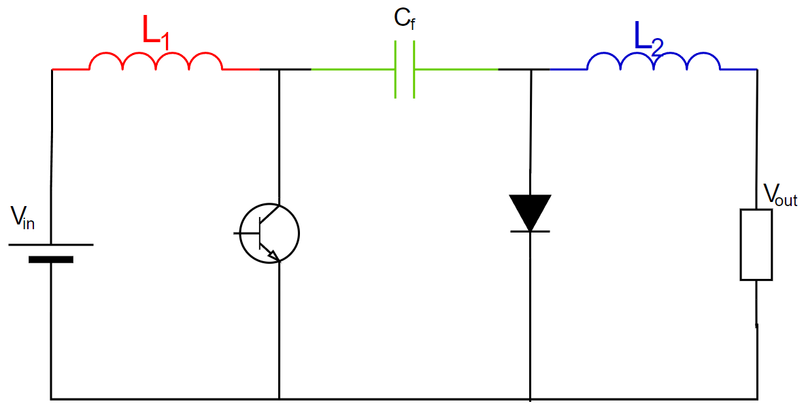

> *优点：输入测和输出侧的电流都是连续的，比较好滤波*
>
> *缺点：输出电压为负，使用时不方便；*
>
> ​			*开关器件和二极管的耐压为电容上的电压，即$V_{in} + |V_{out}|$，耐压等级比普通的Buck电路*和Boost电路高。

电流工作状态详细分析：假设工作在Buck电路，则$d < 0.5$，(Boost模式 也能得到同样的结论)：

​	开关闭合：$L_1$储能，$C_f$放电给$V_{out}$，同时一部分能量存储到$L_2$中。

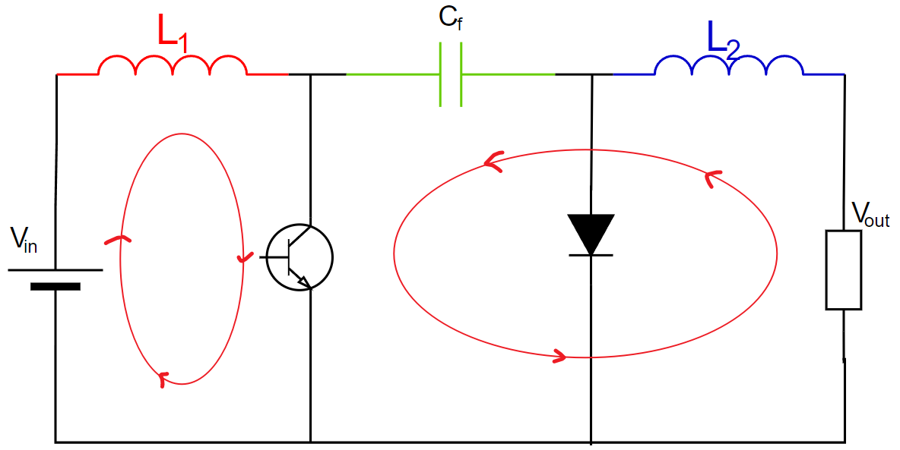

​	开关闭合：$V_{in}$和$L_1$储存的能量一起给$C_f$充电，同时$L_2$将上阶段存储的能量释放给$V_{out}$。

#### 3.2.6 Boost(new)&Buck(new)电路

首先我们来看Boost电路，将Boost(new)电路的电位填充到双电感统一模型中去，电路模型如下：

**首先用通式的方式去分析电路：**$d(V_A - V_B) = (1 - d)(V_C - V_D)$

   代入Boost(new)电路的电位：$d(0 - V_{in}) = (1 - d)(V_{in} - V_{out})$

​                                          展开：$-dV_{in} = (1 - d)V_{in} - (1 - d)V_{out}$

​									  化简得：$\frac{V_{out}}{V_{in}} = \frac{1}{1 - d}$

​	由上式可知，该电路为Boost电路，且输入与输出同向。

**其次可以用另一方面看$V_{out}$的输出范围：**

1、从$L_2$电感来看

​	$V_{out}$介于$V_{in}$和$V_{in} - V_f = V_{in} - (0 - V_{out}) = V_{in} + V_{out}$之间，即$V_{out}$介于$V_{in}$和$V_{in} + V_{out}$之间。

2、从$L_1$电感来看

​	0介于$V_{in}$和$V_{in} + V_f = V_{in} + (0 -V_{out}) = V_{in} - V_{out}$之间，即0介于$V_{in}$和$V_{in} - V_{out}$之间。

> 设输入方向为正，则$V_{in} > 0$
>
> 对于$L_1$：$V_{in} - V_{out} < 0 < V_{in}$
>
> 为满足上式，$V_{out} > V_{in}$
>
> 对于$L_2$：$V_{in} < V_{out} < V_{in} + V_{out}$也是成立得，可以推出该电路为Boost电路，且输入与输出同向。

为更直观的分析电路，将输出变为负载，再根据输入侧在左、输出侧在右的形式变换电路图：

根据电源侧能量流动情况来分析开关的方向，利用续流二极管代替其中一个开关管(降本增效)，用开关管和续流二极管填充：

初步认为稳定后的工作状态如下(有待仿真验证)：

​	开关开通时： $L_1$充电，$C_f$和$V_{in}$一块给$L_2$充电，同时给$V_{out}$放电。

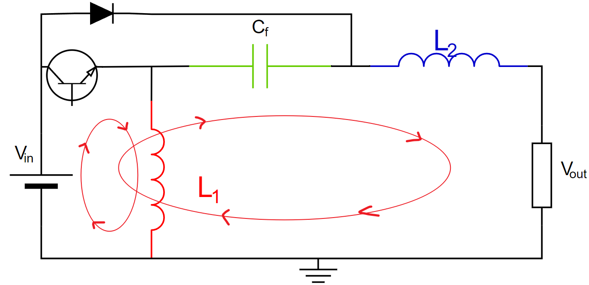

​	开关断开时：$V_{in}$和$L_2$通过续流二极管一块给$V_{out}$放电，同时$L_1$放电给$C_f$。

和原来的Boost电路相比
	优点：输出侧电流连续，易滤波

​	缺点：使用器件多，成本高，控制复杂

#### 3.2.7 Buck-Boost电路总结对比
